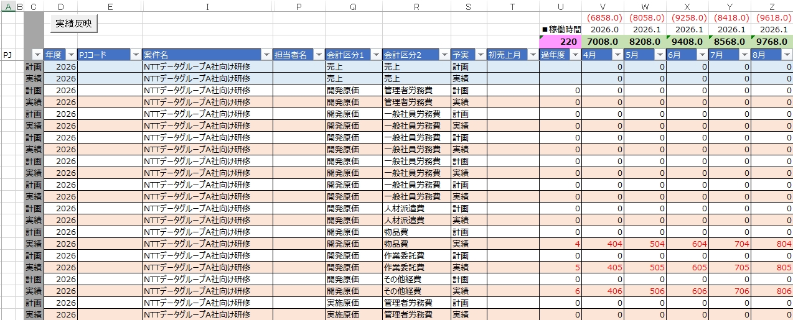

# 実績反映機能 マニュアル

## 概要

　本機能は、実績データをまとめたExcelファイルを読み込み、その内容を
原価管理シートのExcelファイルの「計画算定シート」の該当する行へ自動的に転記する機能です。

  

## 事前準備

　本機能を使う前に、次の2点を準備してください。

### 実績データをまとめたExcelファイルの準備

　実績データをまとめたExcelファイルを、あらかじめパソコンに保存しておいてください。

  

　このExcelファイルは、次の条件を満たしている必要があります。

- 拡張子が `.xlsx` であること
- シート名が「実績」であるシートを含んでいること
- 「実績」シートの1行目はヘッダー行とし、2行目以降にデータを入力すること
- 各行に、以下の列が入力されていること

| 列 | 内容 |
| --- | --- |
| A列 | 年度 |
| B列 | 案件ID |
| AG列 | 区分（「開発」または「実施」） |
| AH列 | 原価区分ID（`4`＝物品費／`9`＝作業委託費／`10`＝その他経費） |
| AJ〜AV列 | 計画算定シートへ転記する実績データ本体 |

### 原価管理シートのExcelファイルの準備

　原価管理シートのExcelファイルを、あらかじめパソコンに保存しておいてください。

  

- ファイルを開いたときにセキュリティの警告が表示されたら、「コンテンツの有効化」を選んで
  マクロを有効にする（有効にしないと「実績反映」ボタン自体が表示されません）。

  

## 使い方

1. 原価管理シートのExcelファイルを開く。

   

     
   

2. 「計画算定シート」を開き、「実績反映」ボタンを押す。

   

     
   

3. ファイル選択ダイアログが開くので、「実績データをまとめたExcelファイル（`.xlsx`）」を選ぶ。

   

     
   

4. 条件に一致した行（次項を参照）が計画算定シートに転記される。

   

     
   

5. 転記された行（U〜AG列が赤字になった行）の内容を確認する。
   - 赤字は「今回転記された行」の印です（値が変わったかどうかは判定していません）。

   

     
   

6. 問題がなければファイルを保存する。
   - 保存すると赤字はすべて黒字に戻り、「実績反映」ボタンが消えます。
   - 「実績反映」ボタンは、ファイルを開き直すと再表示されます。

   

     
   

## 転記条件

　実績データ側の各行は、「計画算定シート」側で次の条件をすべて満たす行にのみ転記されます。

　1件でも条件に合う行が無い場合、その行は転記されずスキップされます（エラーは出ません）。

- 計画算定シート側の「予実」列（S列）が「実績」であること（「予定」の行は対象外）
- 「年度」（D列）が、実績データ側の「年度」（A列）と一致すること
  - 実績データ側の「年度」が日付形式の場合は、その日付の「年」だけを取り出して比較する
- 「案件ID」（F列）が、実績データ側の「案件ID」（B列）と一致すること
- 「会計区分1」（Q列）が、実績データ側の「区分」（AG列）を下表で変換した値と一致すること

  | 実績データ側の「区分」 | 計画算定シートの「会計区分1」 |
  | --- | --- |
  | 開発 | 開発原価 |
  | 実施 | 実施原価 |

- 「会計区分2」（R列）が、実績データ側の「原価区分ID」（AH列）を下表で変換した値と一致すること

  | 実績データ側の「原価区分ID」 | 計画算定シートの「会計区分2」 |
  | --- | --- |
  | 4 | 物品費 |
  | 9 | 作業委託費 |
  | 10 | その他経費 |

　上記すべてに一致する行が見つかった場合、実績データ側のAJ〜AV列の値を、計画算定シートの
一致した行のU〜AG列へそのままコピーします。
