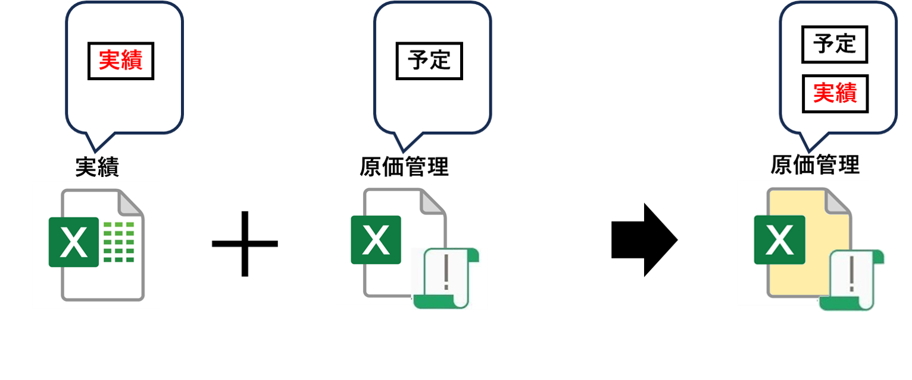
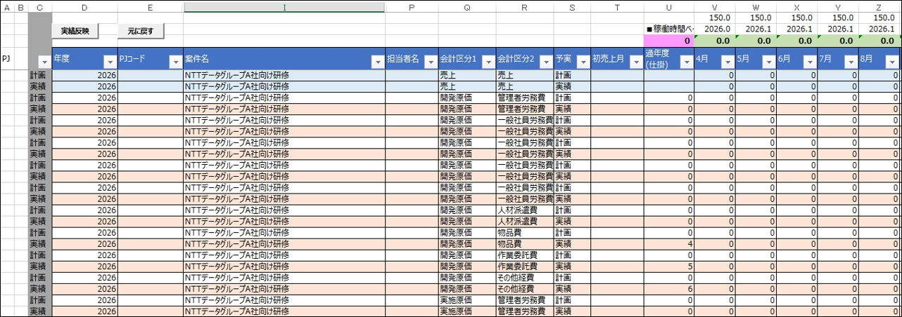
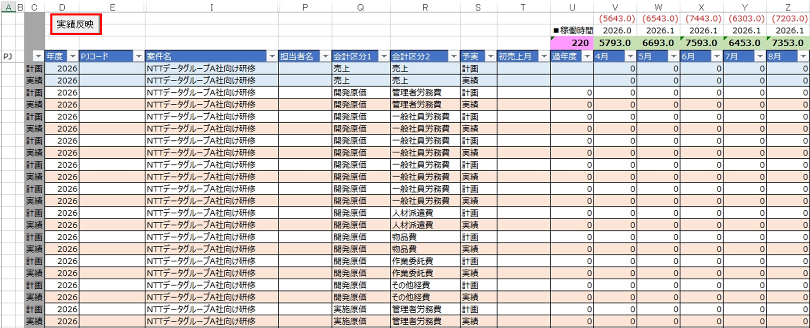
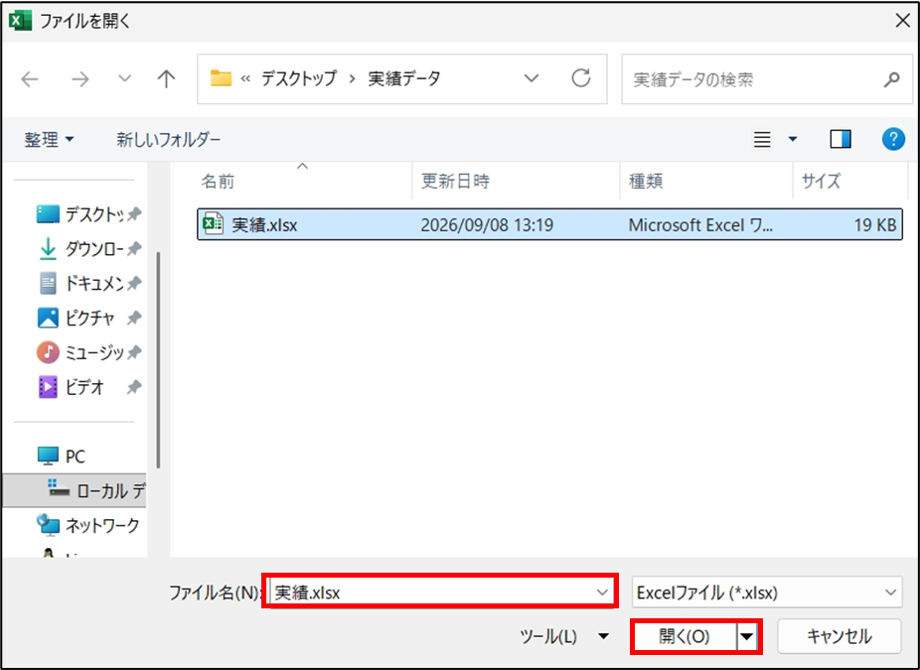
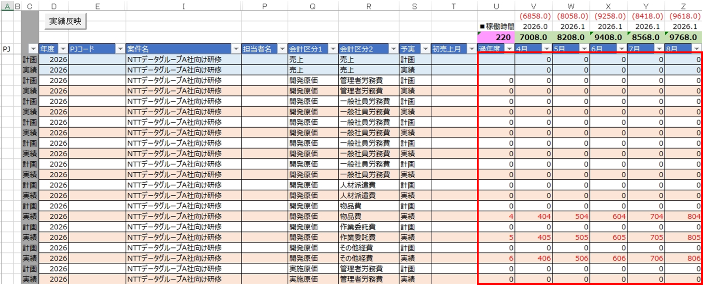
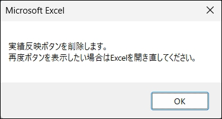
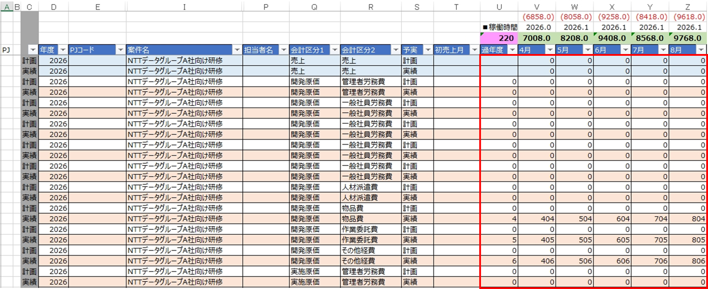
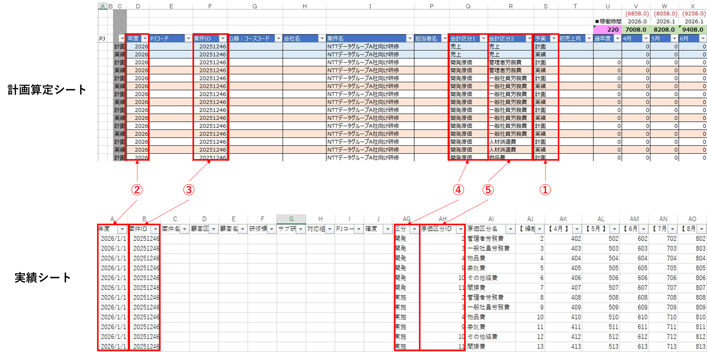

# 実績反映機能 マニュアル

## 本ツールについて

### 概要

　本ツールは、実績データをまとめたExcelファイルの「実績シート」を読み込み、その内容を
原価管理用のExcelファイルの「計画算定シート」の該当する行へ自動的に転記する機能を持っています。

  

### 事前準備

　本機能を使う前に、次の2点を準備してください。

#### 1. 実績データをまとめたExcelファイルの準備

　実績データをまとめたExcelファイルを、あらかじめPCに保存しておいてください。

  

　このExcelファイルは、次の条件を満たしている必要があります。

- 拡張子が `.xlsx` であること
- シート名が「実績」であるシートを含んでいること
- 「実績」シートの1行目はヘッダー行とし、2行目以降にデータを入力すること
- 各行に、以下の列が入力されていること

| 列 | 内容 |
| --- | --- |
| A列 | 年度 |
| B列 | 案件ID |
| AG列 | 区分 |
| AH列 | 原価区分ID |
| AJ〜AV列 | 計画算定シートへ転記する実績データ本体 |

#### 2. 原価管理用のExcelファイルの準備

　原価管理用のExcelファイルを、あらかじめPCに保存しておいてください。

  

- ファイルを開いたときにセキュリティの警告が表示されたら、「コンテンツの有効化」を選んで
  マクロを有効にしてください（有効にしないと「実績反映」ボタン自体が表示されません）。

## 本ツールの使い方

### 利用手順

1. 原価管理用のExcelファイルを開きます。

   

     
   

2. 「計画算定シート」を開き、「実績反映」ボタンを押します。

   

     
   

3. ファイル選択ダイアログが開くので、「実績データをまとめたExcelファイル（`.xlsx`）」を選びます。

   

     
   

4. 条件に一致した行が転記されるので、内容を確認します。
   - なお、転記された箇所はU〜AG列が赤字になります（値が変わったかどうかは判定していません）。

   

     
   

5. 問題がなければファイルを保存します。
   - 以下のダイアログが表示され、「OK」を押下すると赤字はすべて黒字に戻り、「実績反映」ボタンが消えます。
   

     
     
   

### 転記条件

　実績シート側の各行は、計画算定シート側との間で次の条件をすべて満たす場合にのみ転記されます。

   

     
   

1. 計画算定シート側の「予実」列（S列）の値が「実績」であること（「予定」の行は対象外）
2. 実績シート側の「年度」（A列）の値が、計画算定シート側の「年度」（D列）の値と一致すること
   - 実績シート側の「年度」の値が日付形式の場合は、その日付の「年」だけを取り出して比較します
3. 実績シート側の「案件ID」（B列）の値が、計画算定シート側の「案件ID」（F列）の値と一致すること
4. 実績シート側の「区分」（AG列）の値を下表で変換した値が、計画算定シート側の「会計区分1」（Q列）の値と一致すること

  | 実績シート側の「区分」 | 計画算定シートの「会計区分1」 |
  | --- | --- |
  | 開発 | 開発原価 |
  | 実施 | 実施原価 |

5. 実績シート側の「原価区分ID」（AH列）の値を下表で変換した値が、計画算定シート側の「会計区分2」（R列）の値と一致すること

  | 実績シート側の「原価区分ID」 | 計画算定シートの「会計区分2」 |
  | --- | --- |
  | 4 | 物品費 |
  | 9 | 作業委託費 |
  | 10 | その他経費 |

