# S2k 操作マニュアル

このドキュメントは、SMSを受信してkintoneへ登録・更新するAndroidアプリ「S2k」の操作マニュアルです。

## 注意点

- 端末に「Google メッセージ」アプリのインストールが必要です（[SMS送信画面](#sms送信画面)でSMSを長押しして返信する機能は、標準のSMSアプリの返信画面を呼び出す仕組みのため）。

## 画面一覧

1. [トップ画面](#トップ画面)
2. [SMS送信画面](#sms送信画面)
3. [ログ画面](#ログ画面)
4. [kintone設定画面](#kintone設定画面)
5. [アプリ設定画面](#アプリ設定画面)

---

## トップ画面

アプリ起動時に最初に表示される画面。現在の動作モードを確認し、他の画面へ移動するための入口。

  

### 機能一覧

- 現在の送信モードの表示（自動モード／手動モード）
- 各画面への移動ボタン
  - SMSの送信
  - ログの確認
  - kintoneの設定
  - アプリの設定

### 機能ごとの説明

**現在の送信モードの表示**

画面上部に「自動モード」または「手動モード」が大きく表示されます。これは[アプリ設定画面](#アプリ設定画面)の「SMSの送信モード」で選んだ設定と連動しています。

- 自動モード：受信したSMSを自動でkintoneへ送信する設定になっている状態
- 手動モード：SMS送信画面から手動で選んで送信する設定になっている状態

  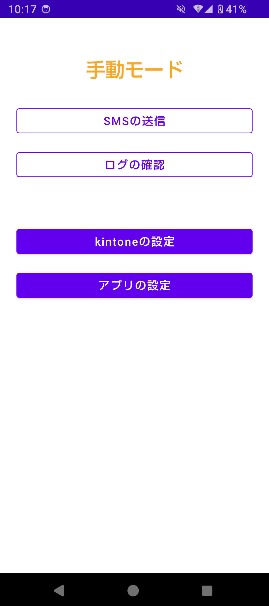

**各画面への移動ボタン**

- 「SMSの送信」：[SMS送信画面](#sms送信画面)を開きます。受信済みのSMSを検索し、手動でkintoneへ送信する画面です。
- 「ログの確認」：[ログ画面](#ログ画面)を開きます。SMSの受信・送信の履歴を確認できます。
- 「kintoneの設定」：[kintone設定画面](#kintone設定画面)を開きます。kintoneへの接続先（送信先）を設定します。
- 「アプリの設定」：[アプリ設定画面](#アプリ設定画面)を開きます。送信モードや自動更新間隔など、アプリ全体の動作を設定します。

  

---

## SMS送信画面

受信済みのSMSを検索し、内容を確認したうえで手動でkintoneへ送信するための画面。「手動モード」で運用する場合の主な操作画面です。

  

### 機能一覧

- SMS読み取り権限のリクエスト（未許可の場合のみ表示）
- 検索条件の表示・非表示切り替え
- 検索条件（受信日の範囲、送信先、未送信のみ／形式が不正のみ）
- 検索
- 全選択／選択解除
- SMSの一覧表示（下に引っ張って更新／長押しで返信）
- 選択したSMSの送信

### 機能ごとの説明

**SMS読み取り権限のリクエスト**

端末のSMS読み取り権限（READ_SMS）が許可されていない場合、検索条件や一覧の代わりに説明文と「SMSの読み取りを許可する」ボタンが表示されます。ボタンを押すと端末の権限確認ダイアログが表示され、許可すると通常の画面に切り替わります。

  

**検索条件の表示・非表示切り替え**

見出し「検索条件」の右にあるボタンで、検索条件の入力欄をまとめて隠す／表示できます。一覧をより広く見たいときに隠すと便利です。

  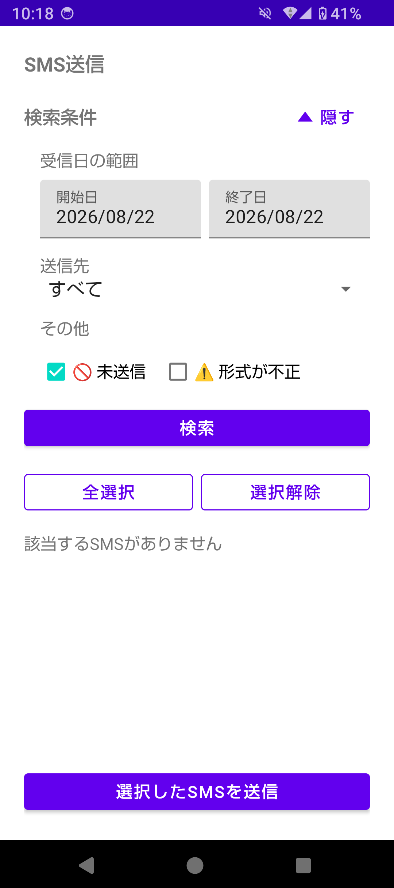

**検索条件**

- 開始日／終了日：それぞれタップするとカレンダーが開き、日付を選べます。画面を開いた直後は、[アプリ設定画面](#アプリ設定画面)で設定した「受信日の範囲」に応じた期間が自動で入力されています（例：範囲が1日なら開始日・終了日ともに今日）。
- 送信先：プルダウンから、特定のkintone送信先に一致するSMSだけに絞り込めます。「すべて」の他、設定済みの送信先名、「未設定」（どの送信先にも一致しないSMS）を選べます。画面を開いた直後は、[アプリ設定画面](#アプリ設定画面)で設定した「送信先」が自動で選ばれています。
- 未送信：チェックすると、まだkintoneへの送信が完了していないSMSだけに絞り込みます（既定でチェック済み）。
- 形式が不正：チェックすると、本文の形式が正しく解釈できなかった（会社名・氏名・内容に分割できなかった）SMSだけに絞り込みます。

  

**検索**

「検索」ボタンを押すと、上記の条件で受信ボックスから該当するSMSを検索し、一覧に表示します。画面を開いた直後や、下に引っ張って更新したときも、同じ条件で自動的に検索されます。

  

**全選択／選択解除**

一覧に表示されているSMSのチェックボックスを、まとめてON／OFFできます。

  

**SMSの一覧表示**

各SMSは以下の内容が1件ずつ表示されます。

- 送信先名（送信先が未設定、または本文の形式が不正な場合は🚫・⚠️マークが付きます）
- 受信日時と送信元
- 本文の先頭部分
- すでに送信済みのSMSは、自動送信なら青系、手動送信ならアンバー系の背景色でハイライトされます

一覧を下に引っ張ると、現在の検索条件でその場で再検索されます（プルリフレッシュ）。また、1件のSMSを長押しすると、標準のSMSアプリの返信画面が開き、[アプリ設定画面](#アプリ設定画面)で設定した文言（本文の形式が不正な場合は専用の文言）が自動で入力されます。

  

**選択したSMSの送信**

チェックを付けたSMSを「選択したSMSを送信」ボタンでkintoneへ送信します。送信中はバックグラウンドで1件ずつ順番に処理され、完了すると成功・失敗件数がメッセージで表示され、一覧が自動的に更新されます。

  

---

## ログ画面

SMSの受信・kintoneへの送信の履歴を確認するための画面。

  

### 機能一覧

- ログの自動更新（[アプリ設定画面](#アプリ設定画面)の設定に連動）
- 手動更新（下に引っ張る／更新ボタン）
- ログのクリア
- ログ一覧の表示

### 機能ごとの説明

**ログの自動更新**

[アプリ設定画面](#アプリ設定画面)で「自動更新」を有効にしている場合、画面を開いている間は設定した更新間隔（秒）ごとに自動で最新のログを再取得します。

  

**手動更新**

「更新」ボタン、または一覧を下に引っ張ることで、その時点の最新のログを表示し直します。

  

**ログのクリア**

「クリア」ボタンを押すと確認ダイアログが表示され、OKを押すとログが全件削除されます。この操作は取り消せません。

  

**ログ一覧の表示**

ログは新しいものから順に、1件ずつ以下の内容が表示されます。

- ログの種別（受信完了／送信開始／送信完了）と記録日時。送信系のログは自動送信なら青、手動送信ならアンバーで区別されます
- 送信先名（未設定の場合は「未設定」と表示）
- SMSの送信元と受信日時
- SMS本文の抜粋
- 結果（成功／失敗）とその詳細メッセージ（緑＝成功、赤＝失敗）
- 本文から会社名・氏名・内容への分割に成功したかどうか（対応するログにのみ表示）

  

---

## kintone設定画面

kintoneへの接続先（送信先）を設定する画面。SMSの送信元やキーワードごとに、複数の送信先を登録できます。

  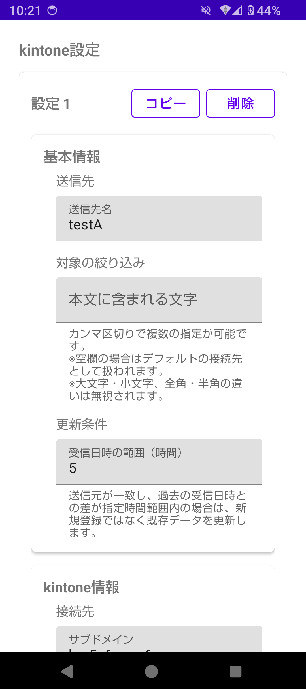

### 機能一覧

- 送信先プロファイルの追加・コピー・削除
- 送信先ごとの設定入力（基本情報／kintone情報）
- テスト送信
- 設定の保存

### 機能ごとの説明

**送信先プロファイルの追加・コピー・削除**

- 「設定を追加」：新しい送信先の設定カードを一番下に追加します。
- 「コピー」：カード内の内容を複製し、その直後に新しいカードとして追加します（名前の末尾に「のコピー」が付きます）。似た設定を作るときに便利です。
- 「削除」：そのカードの設定を削除します。削除は「設定を保存」を押すまで確定しません。

各カードの見出しには「設定 1」「設定 2」のように連番が表示されます。

  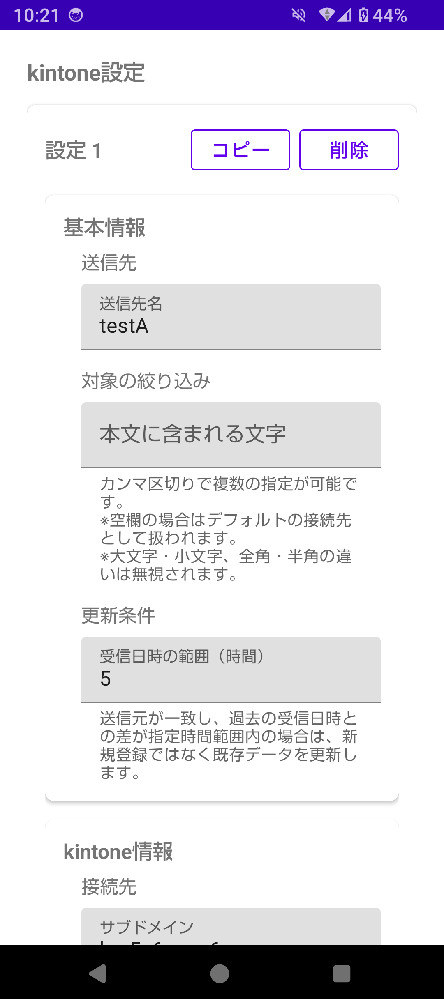

**送信先ごとの設定入力**

各カードは「基本情報」と「kintone情報」の2つの入力欄にまとまっています。

基本情報:
- 送信先名：一覧や履歴で表示される名前
- 対象の絞り込み（本文に含まれる文字）：この送信先を使う条件となるキーワード。カンマ区切りで複数指定できます。空欄の場合は、どのキーワードにも一致しなかったときのデフォルトの送信先として扱われます
- 更新条件（受信日時の範囲）：送信元が一致し、過去の受信日時との差が指定時間以内の既存レコードが見つかった場合は、新規登録ではなく既存データへの更新として扱います

kintone情報:
- 接続先（サブドメイン）
- 認証情報：APIトークン、またはID・パスワードのいずれかを選んで入力します
- アプリ（アプリID）
- フィールドコード：送信元・本文・最終受信日時・登録種別・会社名・氏名・内容の各項目に対応するkintoneのフィールドコードを指定します

  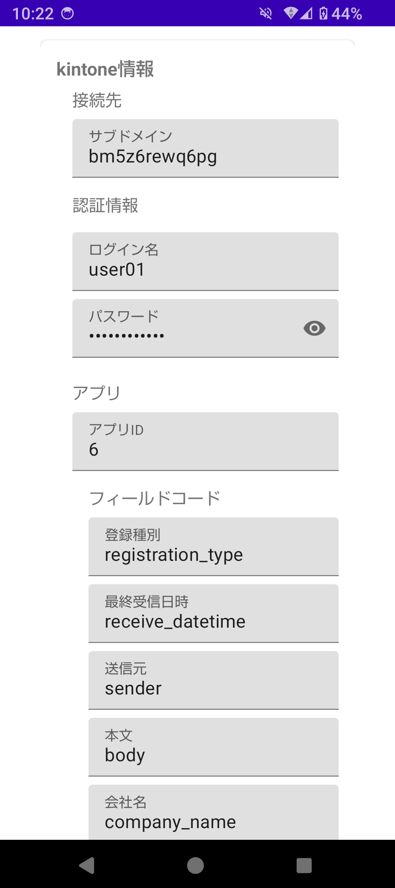

**テスト送信**

「テスト送信」ボタンを押すと、ダミーのSMS本文を使ってその場でkintoneへ実際に送信を試せます。必須項目が未入力の場合はエラーが表示され、送信は行われません。結果（成功／失敗の詳細）はダイアログで表示されます。

  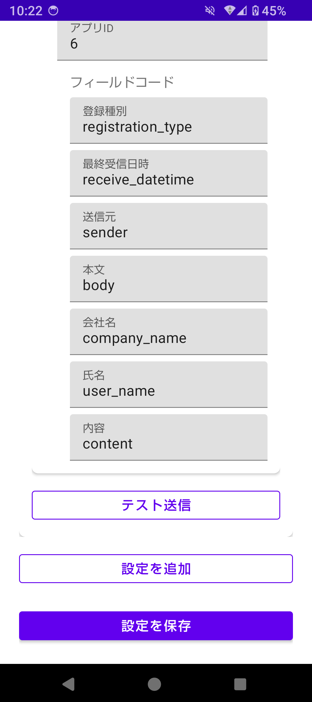

**設定の保存**

「設定を保存」ボタンを押すと、すべてのカードの入力内容を検証します。送信先名・サブドメイン・認証情報・アプリID・フィールドコードのいずれかが未入力のカードがあると、そのカード名（または番号）を示すエラーダイアログが表示され、保存は行われません。すべて問題なければ保存され、トップ画面へ戻ります。

  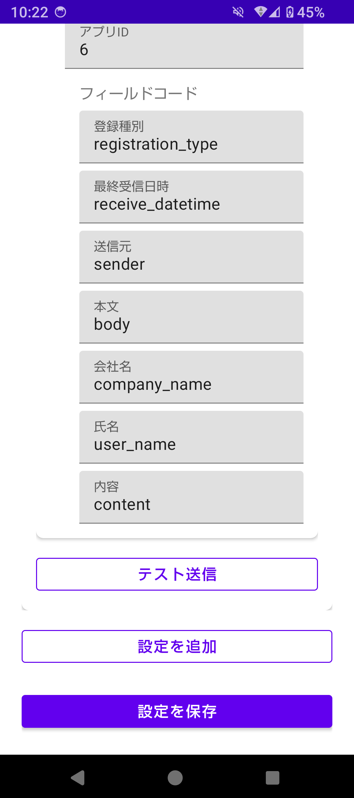

---

## アプリ設定画面

アプリ全体の動作（送信モード、ログの自動更新、SMS検索のデフォルト条件など）を設定する画面。項目を変更すると即座に保存されます（保存ボタンはありません）。

  

### 機能一覧

- レイアウト（表示テーマ）
- 端末の許可（SMS受信）
- ログ（自動更新）
- SMS検索（受信日の範囲・送信先・統合範囲・返信メッセージの初期値）
- SMS送信（送信モード・送信対象・会社名の変換）

### 機能ごとの説明

**レイアウト（表示テーマ）**

ライト／ダークのどちらの配色で表示するかを選べます（ラジオボタン）。

  

**端末の許可**

SMS受信の許可状況を確認できます。すでに許可されている場合は「SMS受信 : 許可済み」と表示され、未許可の場合は「SMSの受信を許可する」ボタンが表示されます（このアプリはSMS受信の許可がないと動作しません）。

  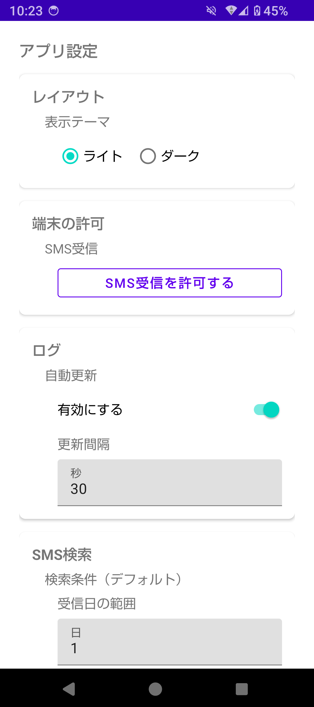

**ログの自動更新**

「有効にする」をONにすると、[ログ画面](#ログ画面)を開いている間、指定した更新間隔（秒）ごとに自動でログを再取得します。

  

**SMS検索（デフォルト設定）**

[SMS送信画面](#sms送信画面)を開いたときに、最初から適用される検索条件を設定します。

- 受信日の範囲（日）：開始日を「今日から何日前」にするかを指定します（1を指定すると開始日・終了日ともに今日になります）
- 送信先：デフォルトで絞り込む送信先を選びます（「すべて」も選択可能）
- 統合範囲（±秒）：自動送信のログはSMSの固有IDを持たないため、送信元と受信日時の近さでSMSと突き合わせます。その際の許容誤差（秒）です。[SMS送信画面](#sms送信画面)の「未送信」フィルタの精度に影響します

  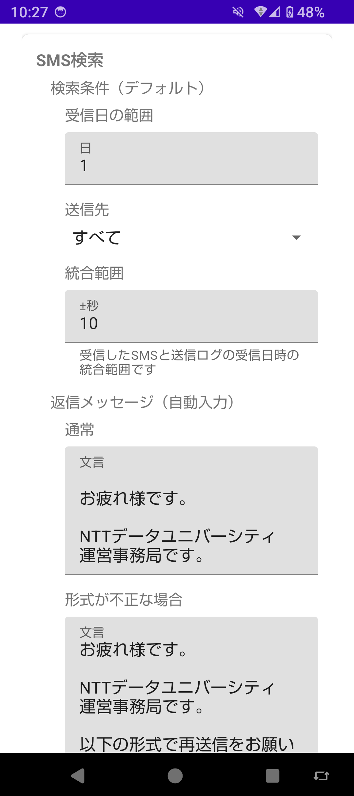

**返信メッセージ（自動入力）**

[SMS送信画面](#sms送信画面)でSMSを長押しして返信画面を開いたときに、自動で入力される文言です。

- 通常：本文の形式が正しく解釈できたSMSに返信する場合の文言
- 形式が不正な場合：本文の形式が解釈できなかったSMSに返信する場合の文言（訂正を依頼する文言などを想定）

  

**SMSの送信モード**

「手動」「自動」から選びます。自動を選ぶと、SMSを受信した時点で自動的にkintoneへ送信されます（[トップ画面](#トップ画面)の表示にも反映されます）。ただし、本文の形式が不正なSMSについては「送信対象」の設定に応じて送信をスキップできます。手動を選ぶと、[SMS送信画面](#sms送信画面)で選んだSMSだけが送信されます（この場合は「送信対象」の設定に関わらず、選んだSMSは常に送信されます）。

  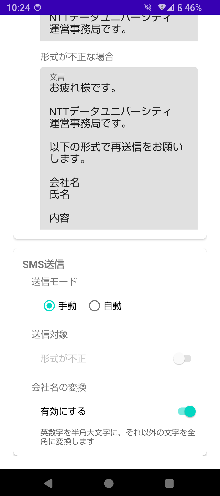

**送信対象**

自動モードのときのみ有効になる設定です。「形式が不正」をONにすると、本文の形式が不正なSMS（会社名・氏名・内容に分割できなかったもの）も自動送信の対象に含めます。OFF（既定）の場合、形式が不正なSMSは自動送信をスキップし、その旨がログに記録されます。手動モードのときはグレーアウトして操作できません（手動送信では常に送信対象になります）。

  

**会社名の変換**

「有効にする」をONにすると、kintoneへ送信する会社名について、英字を半角大文字に、数字を半角に、それ以外（かな・カナ・記号など）を全角に統一してから送信します。OFF（既定）の場合は、SMS本文から抽出した会社名をそのまま送信します。

  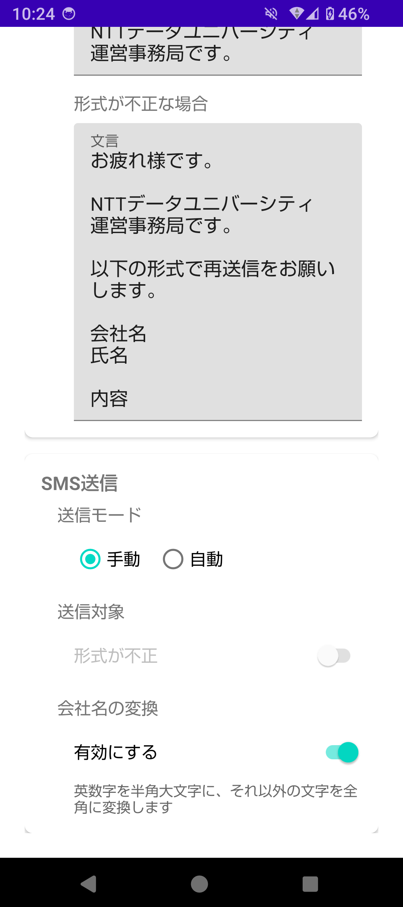

