# S2k 操作マニュアル

## 本ツールについて

### 概要
S2kは、受信したSMSをkintoneアプリのレコードとして保存（登録・更新）するアプリです。

### 動作環境

- Android 8.0（API 26）以降
- 端末に「Google メッセージ」アプリがインストールされていること
- 端末のSMSの読み取り・受信・送信の権限（詳細は[アプリの設定画面](#アプリの設定画面)の「端末の許可」を参照）
- インターネット接続（kintoneへの登録に使用します）
- kintone側：レコードを登録するアプリと、その接続情報（サブドメイン・認証情報・アプリID・フィールドコード）
- （任意）本文の抽出にAIを使う場合：Pixel 8以降など、対応チップを搭載した端末

### 導入手順

1. アプリをインストールし、起動します
2. [アプリの設定画面](#アプリの設定画面)の「端末の許可」から、SMSの読み取り・受信・送信を許可します
3. [送信先の設定画面](#送信先の設定画面)で送信先を1件以上追加し、kintoneの接続情報（サブドメイン・認証情報・アプリID・フィールドコード）を入力して保存します
4. [アプリの設定画面](#アプリの設定画面)で、送信モード・返信モードなど運用に合わせた設定を行います
5. [トップ画面](#トップ画面)で、現在の送信モード・返信モードが意図した設定になっているか確認します

---

## 画面の構成について

### 画面の遷移

  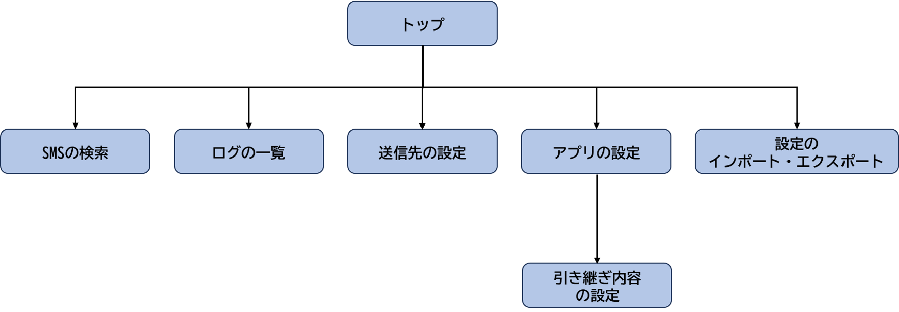

送信先の設定画面は「設定を保存」を押すとトップ画面に戻ります。それ以外の画面は、戻るボタン（または端末の戻るボタン）を押すと遷移元の画面に戻ります。

### 画面の一覧

- [トップ画面](#トップ画面)
- [SMSの検索画面](#SMSの検索画面)
- [ログの一覧画面](#ログの一覧画面)
- [送信先の設定画面](#送信先の設定画面)
- [アプリの設定画面](#アプリの設定画面)
- [引き継ぎ情報の編集画面](#引き継ぎ情報の編集画面)

---

## 各画面の詳細について

### トップ画面

アプリ起動時に最初に表示される画面。現在の動作モードを確認し、他の画面へ移動するための入口です。

  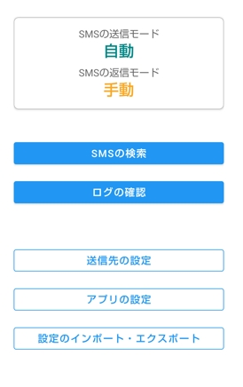

#### 機能一覧

- 現在のモードの表示
- 各画面への移動
  - SMSの検索
  - ログの確認
  - 送信先の設定
  - アプリの設定

#### 機能の詳細

**現在のモードの表示**

画面上部に「SMSの送信モード」、その下に「SMSの返信モード」の見出しとともに、それぞれ「自動」または「手動」が表示されます。送信モードは[アプリの設定画面](#アプリの設定画面)の「送信モード」、返信モードは同画面の「返信モード」で選んだ設定と連動しており、互いに独立して設定できます。

- 送信モード 自動：受信したSMSを自動で送信する設定になっている状態
- 送信モード 手動：SMSの検索画面から手動で選んで送信する設定になっている状態
- 返信モード 自動：本文の形式が異常なSMSを受信した際に、自動でSMSを返信する設定になっている状態
- 返信モード 手動：自動返信を行わない状態（返信はSMSの検索画面から手動で行います）

  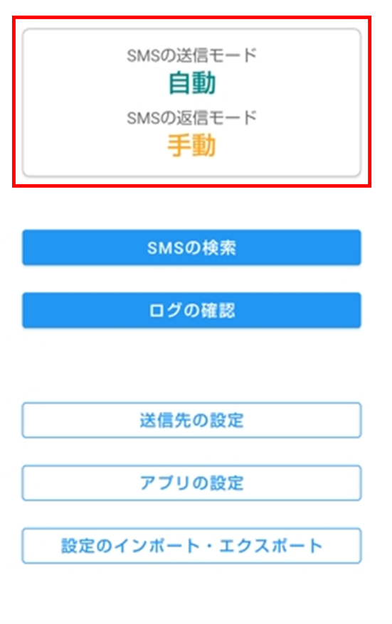

**各画面への移動**

- 「SMSの検索」：[SMSの検索画面](#SMSの検索画面)を開きます。受信済みのSMSを検索し、手動でSMSを送信する画面です。
- 「ログの確認」：[ログの一覧画面](#ログの一覧画面)を開きます。SMSの受信・送信・返信の履歴を確認できます。
- 「送信先の設定」：[送信先の設定画面](#送信先の設定画面)を開きます。SMSの送信先を設定します。
- 「アプリの設定」：[アプリの設定画面](#アプリの設定画面)を開きます。送信モードや自動更新間隔など、アプリ全体の動作を設定します。

  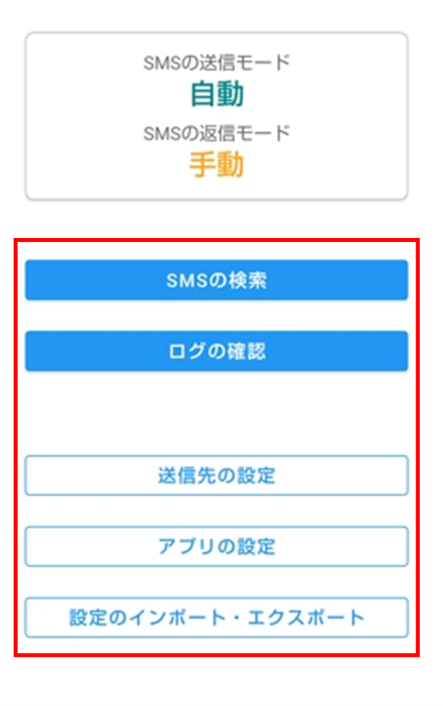

---

### SMSの検索画面

受信済みのSMSを検索し、内容を確認したうえで手動でSMSを送信するための画面。「手動モード」で運用する場合の主な操作画面です。

  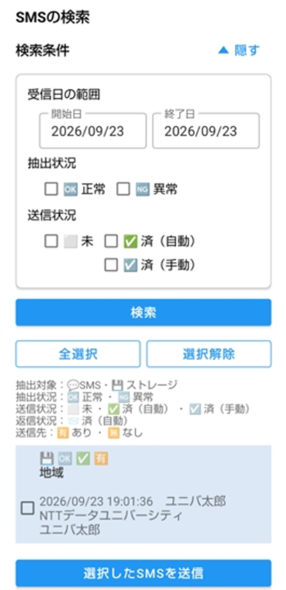

#### 機能一覧

- 端末の権限の案内表示
- 検索条件の表示・非表示の切り替え
- 検索条件（受信日の範囲、送信先、送信状況（未送信／済（自動）／済（手動））、形式（正常／異常／除外））
- 検索
- 全選択／選択解除
- SMSの一覧表示
- SMS一覧の更新
- SMSの返信
- SMSの送信

#### 機能の詳細

**端末の権限の案内表示**

端末のSMSの読み取り権限（READ_SMS）が許可されていない場合、検索条件や一覧の代わりに「アプリ設定画面の『端末の許可』の『SMSの読み取り』を許可してください」という案内文が表示されます。権限の許可自体は[アプリの設定画面](#アプリの設定画面)の「端末の許可」から行います。許可すると、この画面を開き直したときに通常の画面に切り替わります。

  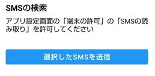

**検索条件の表示・非表示の切り替え**

見出し「検索条件」の右にあるボタンで、検索条件の入力欄をまとめて隠す／表示できます。一覧をより広く見たいときに隠すと便利です。画面を開いた直後の表示・非表示は、[アプリの設定画面](#アプリの設定画面)の「検索条件の表示」設定に従います。

  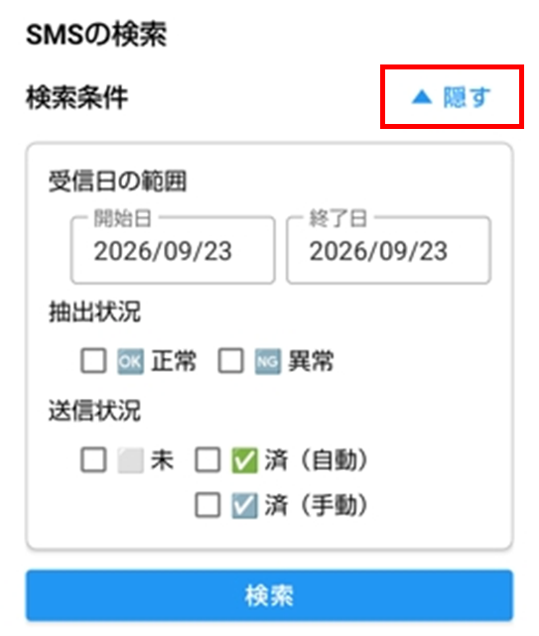
  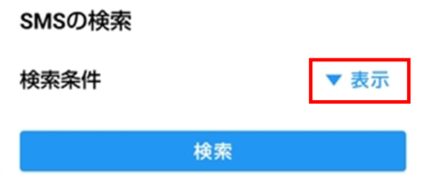

**検索条件**

- 開始日／終了日：それぞれタップするとカレンダーが開き、日付を選べます。画面を開いた直後は、[アプリの設定画面](#アプリの設定画面)で設定した「受信日の範囲」に応じた期間が自動で入力されています（例：範囲が1日なら開始日・終了日ともに今日）。
- 送信先：プルダウンから、特定の送信先に一致するSMSだけに絞り込めます。「すべて」の他、設定済みの送信先名、「未設定」（どの送信先にも一致しないSMS）を選べます。画面を開いた直後は、[アプリの設定画面](#アプリの設定画面)で設定した「送信先」が自動で選ばれています。送信先が1件しか設定されていない場合は、絞り込んでも結果が変わらないためこの項目自体が表示されません。
- 送信状況「未」・「済（自動）」・「済（手動）」：チェックした送信状況のSMSだけに絞り込みます。いずれもチェックしない場合は送信状況による絞り込みを行いません。
- 形式「正常」・「異常」・「除外」：チェックした形式判定のSMSだけに絞り込みます（本文から会社名・氏名を抽出できなかった場合が「異常」、過去に届いた形式正常なSMSから会社名・氏名・送信先を引き継いだ場合が「除外」。引き継ぎについては[アプリの設定画面](#アプリの設定画面)の「SMSの引き継ぎ」を参照）。いずれもチェックしない場合は形式による絞り込みを行いません。

  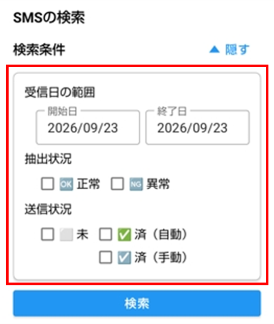

**検索**

「検索」ボタンを押すと、上記の条件で受信ボックスから該当するSMSを検索し、一覧に表示します。画面を開いた直後や、下に引っ張って更新したときも、同じ条件で自動的に検索されます。

  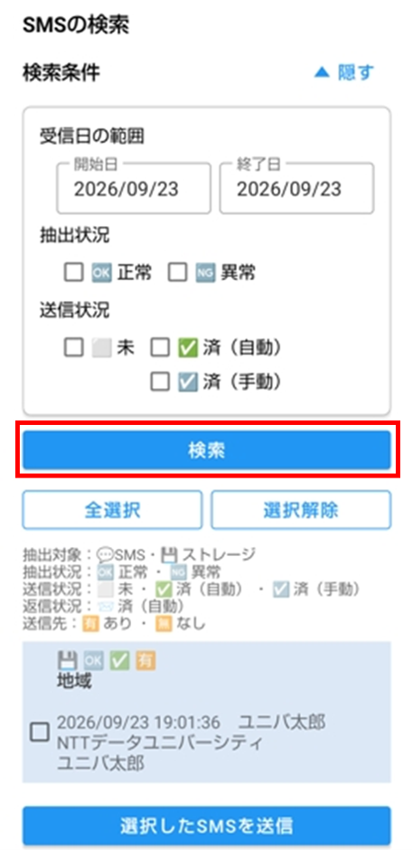

**全選択／選択解除**

一覧に表示されているSMSのチェックボックスを、まとめてON／OFFできます。選択できない状態（グレーアウト）のSMSは対象になりません。

  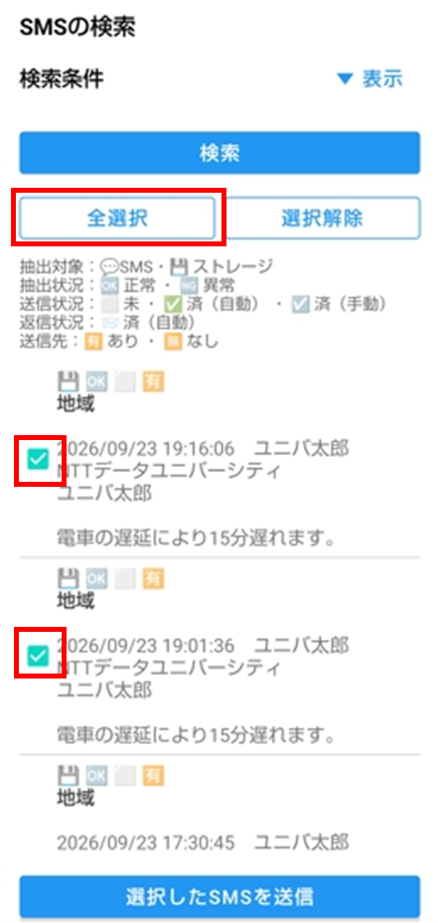
  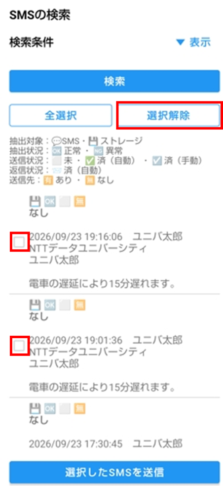

**SMSの一覧表示**

各SMSは以下の内容が1件ずつ表示されます。

- 送信状況（未送信・自動送信済み・手動送信済み・自動返信済みをそれぞれ異なるマークで表示）、本文の形式（正常・異常・除外をそれぞれ異なるマークで表示）、送信先名（送信先の設定に一致した場合・一致しない＝送信先が未設定の場合・過去のSMSから引き継いだ場合をそれぞれ異なるマークで表示）。マークの意味は一覧の上に表示される凡例で確認できます
- 受信日時と送信元
- 本文全体
- すでに送信済みのSMSは、自動送信なら青系、手動送信ならアンバー系の背景色でもハイライトされます

送信先が未設定、本文の形式が異常、または形式が除外（引き継ぎによるもの）のSMSについて、それぞれチェックボックスで選択できるかどうかは[アプリの設定画面](#アプリの設定画面)の「SMS選択の対象」で切り替えられます。

  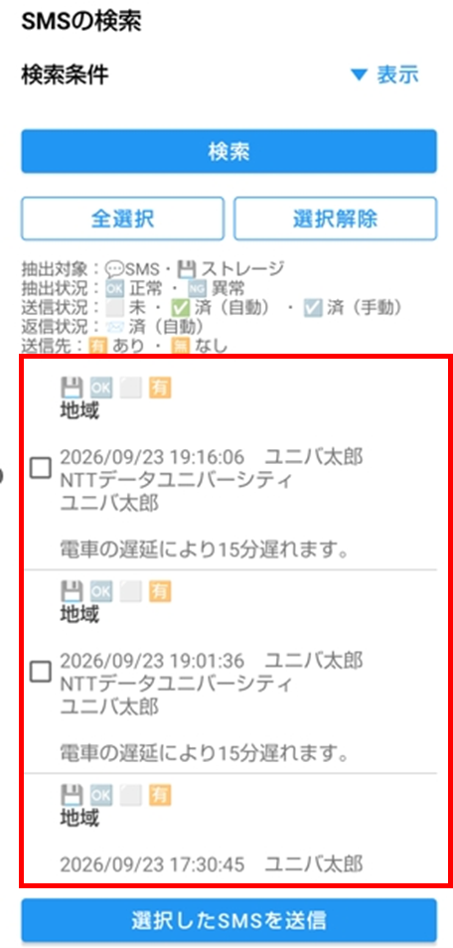

**SMS一覧の更新**

一覧を下に引っ張ると、現在の検索条件でその場で再検索されます（プルリフレッシュ）。

  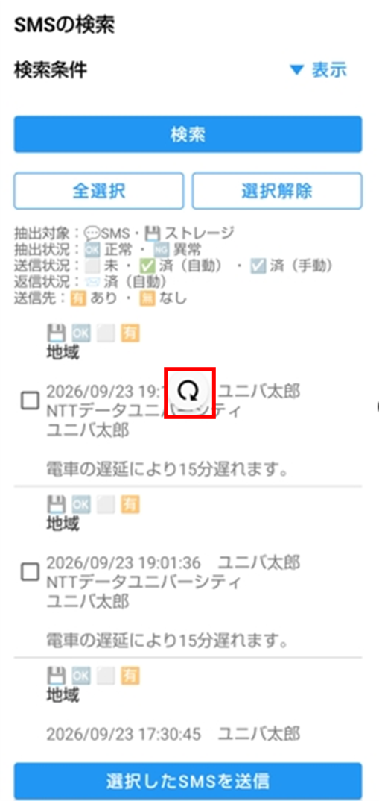

**SMSの返信**

1件のSMSを長押しすると、標準のSMSアプリの返信画面が開き、[アプリの設定画面](#アプリの設定画面)で設定した文言（本文の形式が異常な場合は専用の文言）が自動で入力されます。

  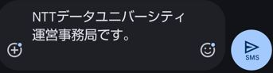

**SMSの送信**

チェックを付けたSMSを「選択したSMSを送信」ボタンで送信します。一覧の表示順（受信日時が新しい順）に関わらず、送信自体は受信日時が古いものから順に、バックグラウンドで1件ずつ処理されます。完了すると成功・失敗件数がメッセージで表示され、一覧が自動的に更新されます。

  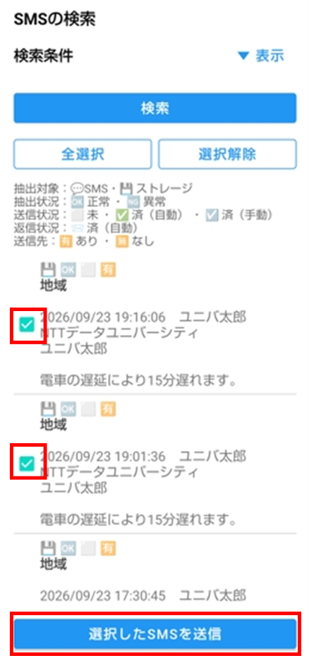

---

### ログの一覧画面

SMSの受信・SMSの送信・SMSの返信の履歴を確認するための画面。

  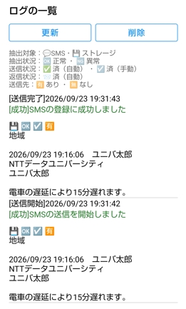

#### 機能一覧

- ログの一覧表示
- ログの手動更新
- ログの自動更新
- ログのクリア
- 抽出結果の詳細表示

#### 機能の詳細

**ログの一覧表示**

ログは新しいものから順に、1件ずつ以下の内容が表示されます。

- ログの種別（受信完了／送信開始／送信完了／返信完了）と記録日時、本文の抽出結果（正常・異常・除外をそれぞれ異なるマークで表示）。送信開始・送信完了のログのみ末尾に自動・手動のマークが付きます。SMSの送信時に会社名の変換を行った場合や、返信完了のログにもそれぞれマークが付きます
- 結果（成功／失敗）とその詳細メッセージ（緑＝成功、赤＝失敗）
- 送信先名（送信先の設定に一致した場合、または過去のSMSから引き継いだ場合はマークとともに送信先名を表示。一致しない＝送信先が未設定の場合はマークとともに「なし」と表示）
- SMSの送信元と受信日時
- SMS本文の抜粋

  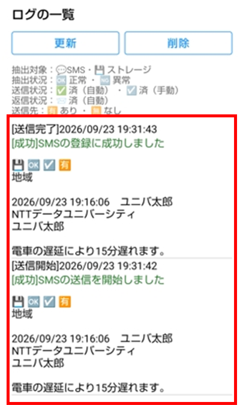

**ログの手動更新**

「更新」ボタン、または一覧を下に引っ張ることで、その時点の最新のログを表示し直します。

  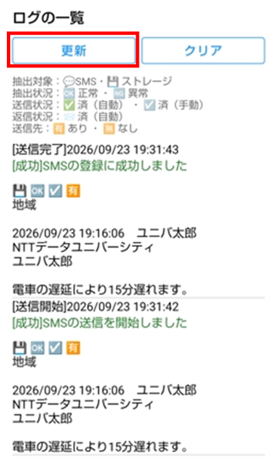
  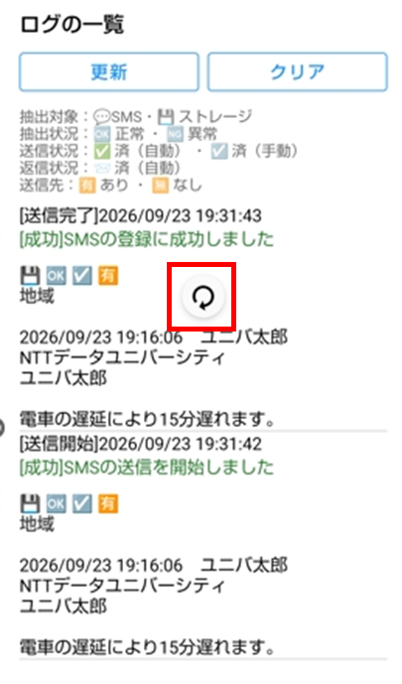

**ログの自動更新**

[アプリの設定画面](#アプリの設定画面)で「自動更新」を有効にしている場合、画面を開いている間は設定した更新間隔（秒）ごとに自動で最新のログを再取得します。

**ログのクリア**

「クリア」ボタンを押すと「ログをクリアしますか？」の確認ダイアログが表示され、「クリア」を押すとログが全件削除されます。この操作は取り消せません。

  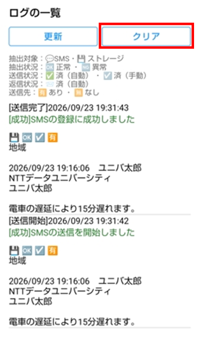
  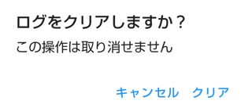

**抽出結果の詳細表示**

「送信完了」のログを長押しすると、送信した会社名（会社名の変換を行った場合は変換後の値）・氏名・本文の値をダイアログで確認できます。ダイアログのタイトル末尾には、その抽出にAIを使ったか、ルールベースを使ったかを示すアイコンが表示されます。

  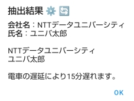

---

### 送信先の設定画面

SMSの送信先を設定する画面。SMSの送信元やキーワードごとに、複数の送信先を登録できます。

  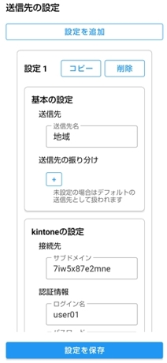

#### 機能一覧

- 送信先の追加
- 送信先のコピー
- 送信先の削除
- 送信先の設定（基本の設定・kintoneの設定・オプション）
- テスト送信
- 設定の保存

#### 機能の詳細

**送信先の追加**

新しい送信先の設定を一番下に追加します。このボタンは画面上部に固定表示されており、送信先が何件あってもスクロールせずに押せます。各送信先の見出しには「設定 1」「設定 2」のように連番が表示されます。

  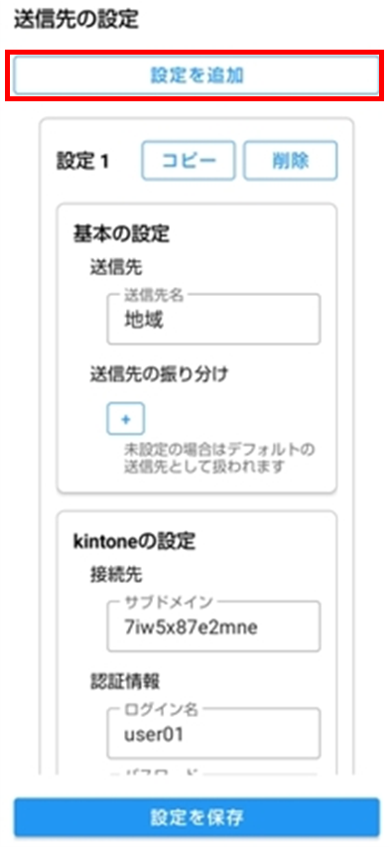

**送信先のコピー**

その送信先の内容を複製し、その直後に新しい送信先として追加します（名前の末尾に「のコピー」が付きます）。似た設定を作るときに便利です。

  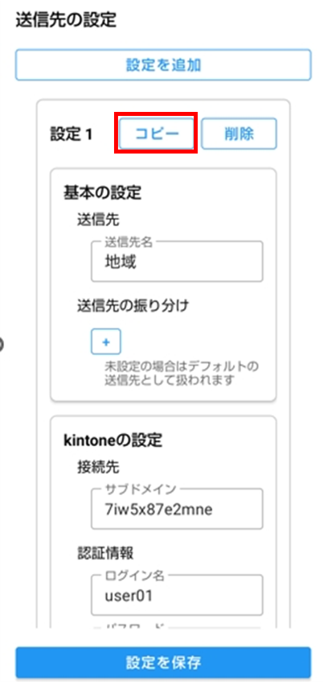

**送信先の削除**

その送信先の設定を削除します。削除は「設定を保存」を押すまで確定しません。

  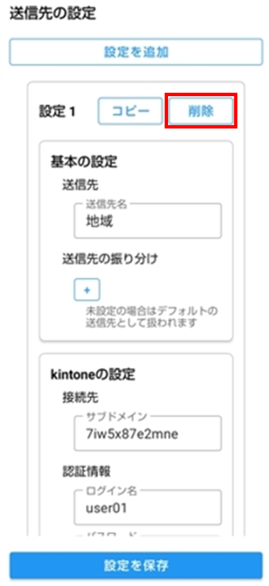

**送信先の設定（基本の設定・kintoneの設定・オプション）**

各送信先は「基本の設定」「kintoneの設定」「オプション」の3つの入力欄にまとまっています。

基本の設定:
- 送信先名：一覧や履歴で表示される名前
- 送信先の振り分け：この送信先を使う条件となるキーワード。「+」で行を追加、「×」で行を削除でき、複数指定できます。空欄の場合は、どのキーワードにも一致しなかったときのデフォルトの送信先として扱われます。複数の送信先の条件に同時に一致した場合は、その全ての送信先へ登録されます
- 送信先の比較対象：上記のキーワードを、本文から抽出した会社名と照合するか、SMSの本文そのものと照合するかを選びます

  

kintoneの設定:
- 接続先（サブドメイン）
- 認証情報：ログイン名・パスワードを入力します
- 連絡用のアプリ（アプリID）
- フィールドコード：送信元・履歴・受信日時・登録種別・会社名・氏名・本文の各項目に対応するkintoneのフィールドコードを指定します
- 統合範囲：新規登録ではなく既存レコードを更新する条件を選びます。「同一日付」は最終受信日時の暦日が同じ場合、「時間」は指定した時間（±時間）以内の場合に更新します。「時間」を選んだ場合のみ「±時間」の入力欄が使えます

  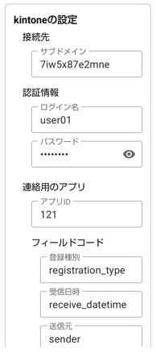
  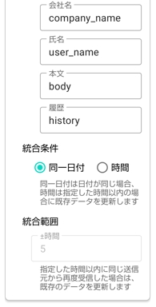

オプション:
- 会社名の変換：有効にすると、会社名を英数字を半角大文字に、それ以外の文字を全角に変換してから送信します

  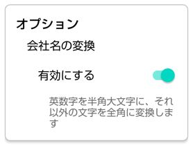

**テスト送信**

「テスト送信」ボタンを押すと、その場でkintoneへ実際に送信を試せます。「設定を保存」を押していなくても、その時点でその送信先に入力されている内容（未保存分を含む）でテストされます。

  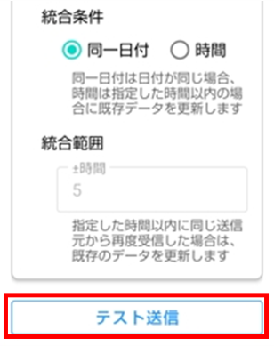

1. 必須項目が未入力の場合はエラーが表示され、テスト送信は行われません。

  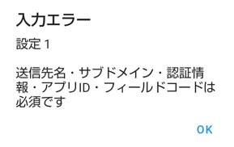

2. 問題なければ「テスト本文」ダイアログが表示され、送信するSMS本文を入力できます。テスト用の文言があらかじめ入力されており、自由に書き換えられます。「送信」を押すと次に進み、「キャンセル」を押すと中止します。

  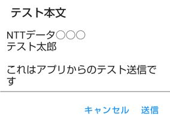

3. 入力した本文（または「送信先の比較対象」が「会社名」の場合はそこから抽出した会社名）が、その送信先自身の「送信先の振り分け」の条件（キーワードに一致するか、条件未設定のデフォルト送信先であるか）に一致しない場合は、テスト送信は行われず「テスト結果」ダイアログに「この本文はこの送信先の振り分け条件に一致しないため、送信していません。」という結果のみが表示されます。

  

4. 条件に一致する場合は実際に送信され、「テスト結果」ダイアログに以下が表示されます。
   - タイトル末尾のアイコン：会社名・氏名の抽出にAIを使ったか、ルールベースを使ったか
   - 会社名・氏名の抽出に成功したかどうか
   - 送信結果（成功／失敗の詳細）
   - 実際に送信した会社名・氏名・本文の値

  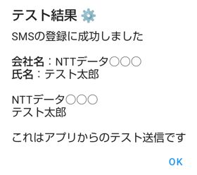

**設定の保存**

「設定を保存」ボタンは画面下部に固定表示されており、送信先が何件あってもスクロールせずに押せます。押すと、すべての送信先の入力内容を検証します。送信先が1件もない場合は「設定を1つ以上追加してください」というメッセージが表示され、保存は行われません。送信先名・サブドメイン・認証情報・アプリID・フィールドコードのいずれかが未入力の送信先がある場合も、その送信先名（または番号）を示すエラーダイアログが表示され、保存は行われません。すべて問題なければ保存され、トップ画面へ戻ります。

  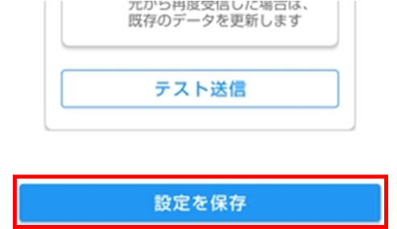

---

### アプリの設定画面

アプリ全体の動作（端末の権限、送信モード、返信モード、ログの自動更新、SMSの検索のデフォルト条件など）を設定する画面。項目を変更すると即座に保存されます（保存ボタンはありません）。

  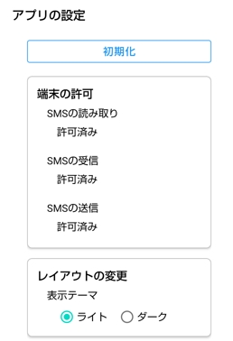

#### 機能一覧

- 端末の許可（SMSの読み取り・SMSの受信・SMSの送信）
- レイアウトの変更（表示テーマ）
- SMSの検索（検索条件の初期値・検索条件の表示・SMS選択の対象）
- SMSの送信（送信モード・自動送信の対象）
- SMSの返信（返信モード・自動返信の間隔・返信メッセージ）
- SMSの引き継ぎ（引き継ぎ・引き継ぎの範囲・送信元の表示・引き継ぎ情報の編集）
- 本文の抽出（AIによる抽出）
- ログ（自動更新・統合範囲・本文の最大表示文字数）

#### 機能の詳細

**端末の許可（SMSの読み取り）**

SMSの検索画面での検索に使用します。未許可の場合、SMSの検索画面は使えません。「SMSの読み取りを許可する」ボタンを押すと、端末の権限確認ダイアログが表示されます。すでに許可されている場合は「許可済み」と表示され、ボタンと説明文は隠れます。

  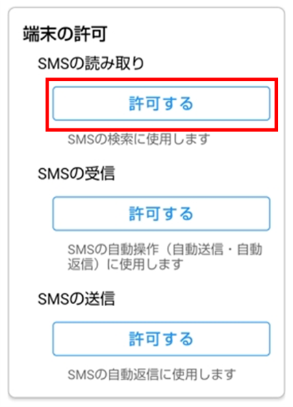

**端末の許可（SMSの受信）**

SMSの自動操作（自動送信・自動返信）に使用します。未許可の場合、SMSを自動検知できないため自動送信・自動返信ともにできません（手動での検索・送信・返信は可能です）。「SMSの受信を許可する」ボタンを押すと、端末の権限確認ダイアログが表示されます。すでに許可されている場合は「許可済み」と表示され、ボタンと説明文は隠れます。

  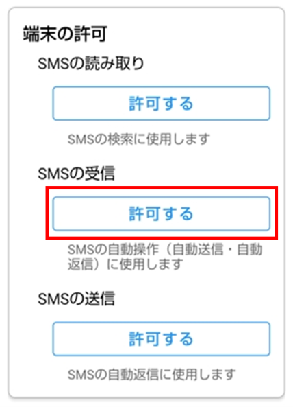

**端末の許可（SMSの送信）**

SMSの自動返信に使用します。未許可の場合、自動返信はできません。「SMSの送信を許可する」ボタンを押すと、端末の権限確認ダイアログが表示されます。すでに許可されている場合は「許可済み」と表示され、ボタンと説明文は隠れます。

  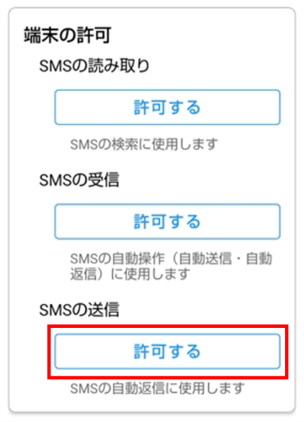

**レイアウトの変更（表示テーマ）**

ライト／ダークのどちらの配色で表示するかを選べます（ラジオボタン）。

  

**SMSの検索（検索条件の初期値）**

[SMSの検索画面](#SMSの検索画面)を開いたときに、最初から適用される検索条件を設定します。

- 受信日の範囲：開始日を「今日から何日前」にするかを指定します（1を指定すると開始日・終了日ともに今日になります）
- 送信先：デフォルトで絞り込む送信先を選びます（「すべて」も選択可能）。送信先が1件しか設定されていない場合は、この項目自体が表示されません
- 送信状況：「未」「済（自動）」「済（手動）」それぞれのチェックボックスを初期状態でONにするかどうかを設定します
- 形式：「正常」「異常」「除外」それぞれのチェックボックスを初期状態でONにするかどうかを設定します

  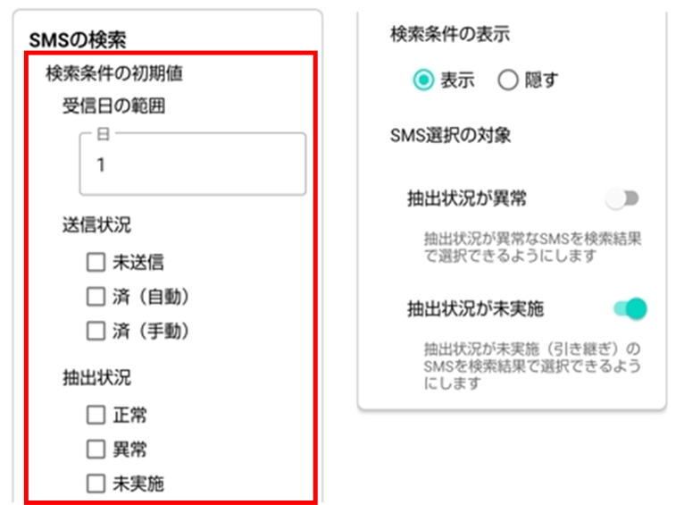

**SMSの検索（検索条件の表示）**

[SMSの検索画面](#SMSの検索画面)を開いたときに、検索条件の入力欄を表示した状態にするか、隠した状態にするかを選べます。

  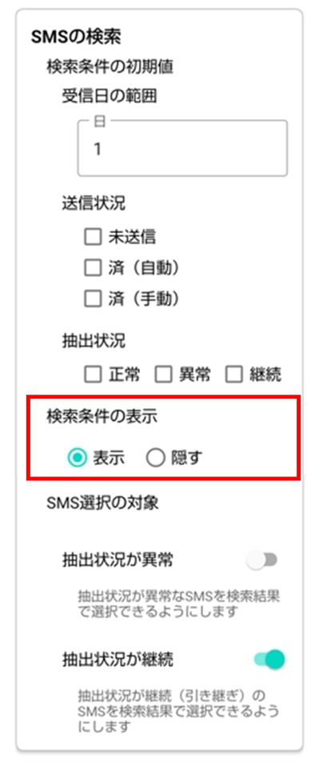

**SMSの検索（SMS選択の対象）**

[SMSの検索画面](#SMSの検索画面)の一覧で、以下に該当するSMSをチェックボックスで選択できるようにするかどうかを、それぞれ個別に設定します。ONにすると、その一覧から選んで手動送信できるようになります。

- 送信先がなし
- 形式が異常
- 形式が除外（引き継ぎによるSMS）

  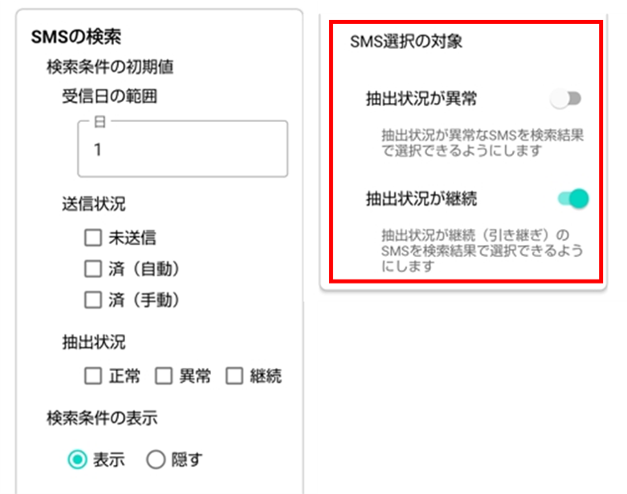

**SMSの送信（送信モード）**

「手動」「自動」から選びます。自動を選ぶと、SMSを受信した時点で自動的にSMSが送信されます（[トップ画面](#トップ画面)の表示にも反映されます）。ただし、本文の形式が異常なSMSについては「自動送信対象」の設定に応じて送信をスキップできます。手動を選ぶと、[SMSの検索画面](#SMSの検索画面)で選んだSMSだけが送信されます。

  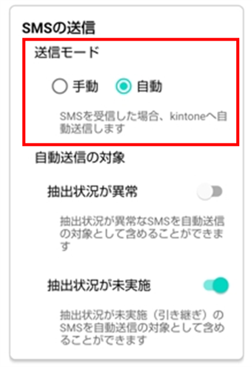

**SMSの送信（自動送信の対象）**

自動モードのときのみ有効になる設定です。手動モードのときはグレーアウトして操作できません。

- 「形式が異常」をONにすると、本文の形式が異常なSMS（会社名・氏名を抽出できなかったもの）も自動送信の対象に含めます。OFFの場合、形式が異常なSMSは自動送信をスキップし、その旨がログに記録されます
- 「形式が除外」をONにすると、形式が除外（引き継ぎによるもの）のSMSも自動送信の対象に含めます。ONの場合、除外形式のSMSは通常どおり自動送信されます。OFFにすると自動送信をスキップし、その旨がログに記録されます

なお、この設定は自動送信のみに影響します。手動でのSMSの検索画面からの送信については、前述の「SMS選択の対象」の設定が別途適用されます。

  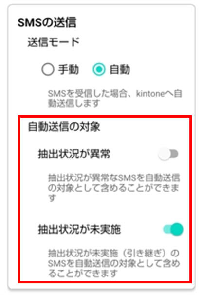

**SMSの返信（返信モード）**

「手動」「自動」から選びます（送信モードとは独立した設定です）。自動を選ぶと、本文の形式が異常なSMSを受信した際に、送信元へ「形式が異常な場合」の返信メッセージを自動でSMS送信します。手動を選ぶと、自動返信は行われません（返信は[SMSの検索画面](#SMSの検索画面)でSMSを長押しして手動で行います）。

  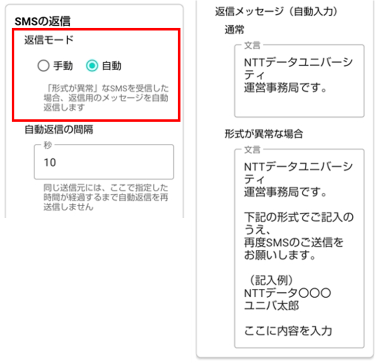

**SMSの返信（自動返信の間隔）**

自動返信が有効な場合に、同じ送信元へ再度自動返信するまでの最短間隔を秒単位で指定します。短時間に同じ送信元から形式が異常なSMSを繰り返し受信しても、この間隔内は再送信されません（連投防止）。

  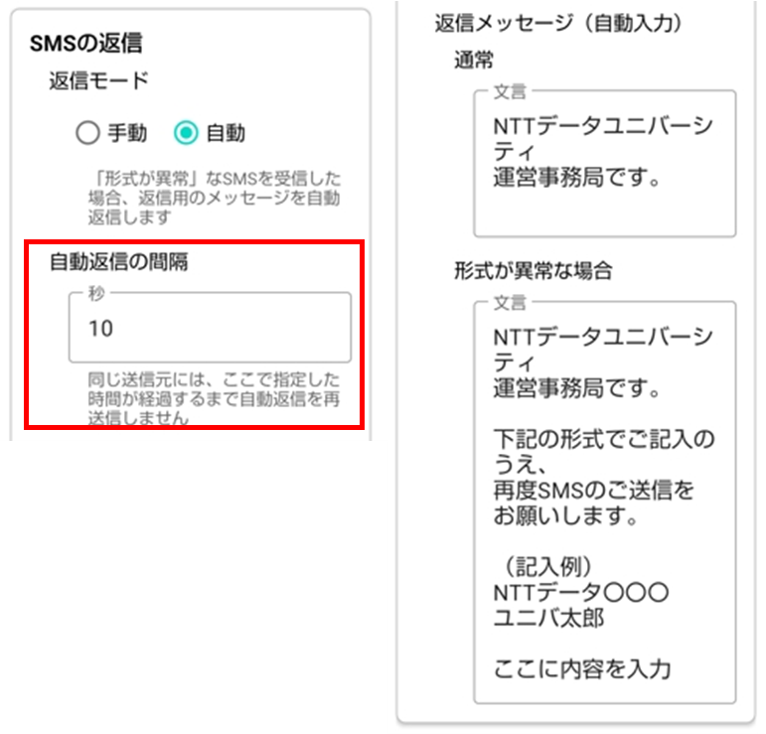

**SMSの返信（返信メッセージ）**

[SMSの検索画面](#SMSの検索画面)でSMSを長押しして返信画面を開いたとき、および自動返信が送信されるときに使われる文言です。

- 通常：本文の形式が正しく解釈できたSMSに返信する場合の文言
- 「形式が異常」な場合：本文の形式が解釈できなかったSMSに返信する場合の文言（訂正を依頼する文言などを想定）。自動返信でもこの文言が使われます

  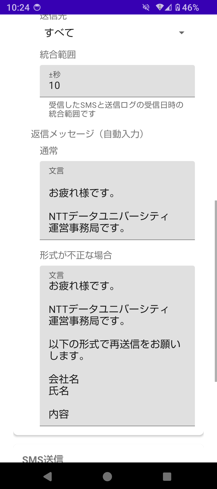

**SMSの引き継ぎ（引き継ぎ）**

同一の送信元から過去に一度でも会社名・氏名の抽出に成功したSMSが届いていれば、それ以降に届く単体では解釈できないSMS（例：会社名・氏名の記載が無い追加の連絡など）についても、本文単体の形式に関わらず、その直近1件から会社名・氏名・送信先を引き継いで登録します（本文は今回届いたSMSそのもの）。引き継ぎによって処理されたSMSは、一覧やログで通常の正常・異常とは別の「除外」として表示されます。「有効にする」は、この機能自体のON／OFFを切り替えます。OFFにすると、常に今回のSMS本文だけで判定します。

  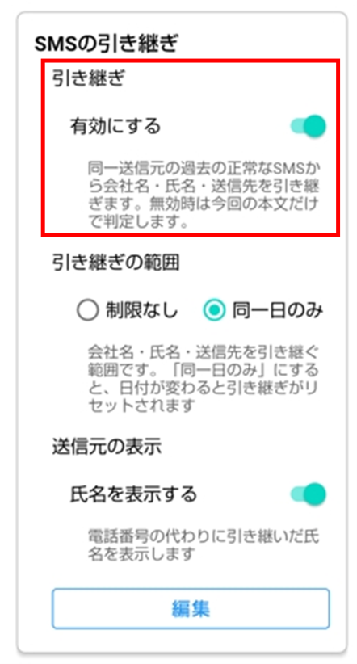

**SMSの引き継ぎ（引き継ぎの範囲）**

「制限なし」（同一送信元なら日付を問わず常に引き継ぐ）と「同一日のみ」（日付が変わると引き継ぎがリセットされる）から選びます。「有効にする」がOFFのときは操作できません。

  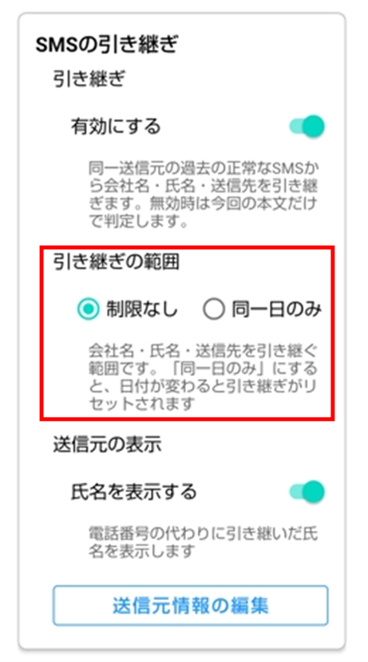

**SMSの引き継ぎ（送信元の表示）**

引き継ぎによるSMSの送信元表示を、電話番号の代わりに引き継いだ氏名にするかどうかを切り替えます。「有効にする」がOFFのときは操作できません。

  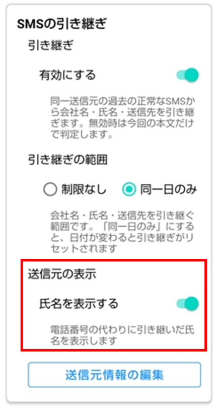

**SMSの引き継ぎ（引き継ぎ情報の編集）**

「編集」を押すと[引き継ぎ情報の編集画面](#引き継ぎ情報の編集画面)が開きます。「有効にする」がOFFのときも操作できます（機能を無効にしていても、過去に記録した引き継ぎ情報の確認・削除は行えます）。

  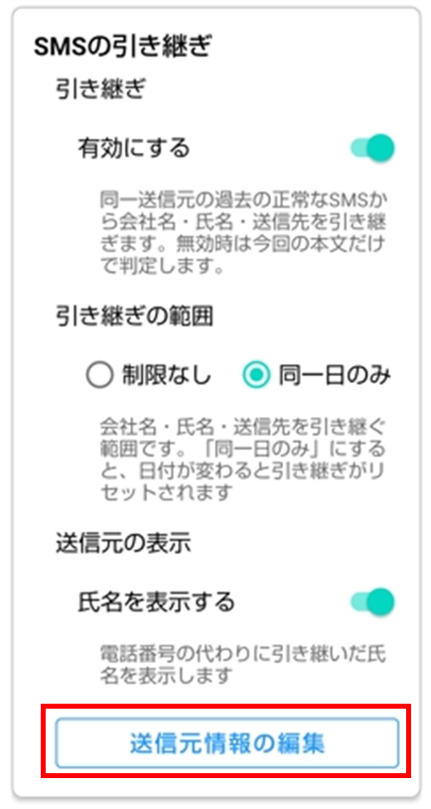

**本文の抽出（AIによる抽出）**

「有効にする」をONにすると、SMS本文から会社名・氏名を抽出する際に、通常のルールベースの解析の代わりに端末上のAI（Gemini Nano）を使用します。対応端末（Pixel 8以降など、対応チップを搭載した一部の機種のみ）が無い場合や、AIの呼び出しに失敗した場合は、自動的にルールベースの解析にフォールバックします。この設定は自動送信・手動送信・[SMSの検索画面](#SMSの検索画面)での「形式が異常」の判定・自動返信のすべてに共通して適用されます（過去のSMSから引き継いだ場合はこの抽出自体を行いません）。

  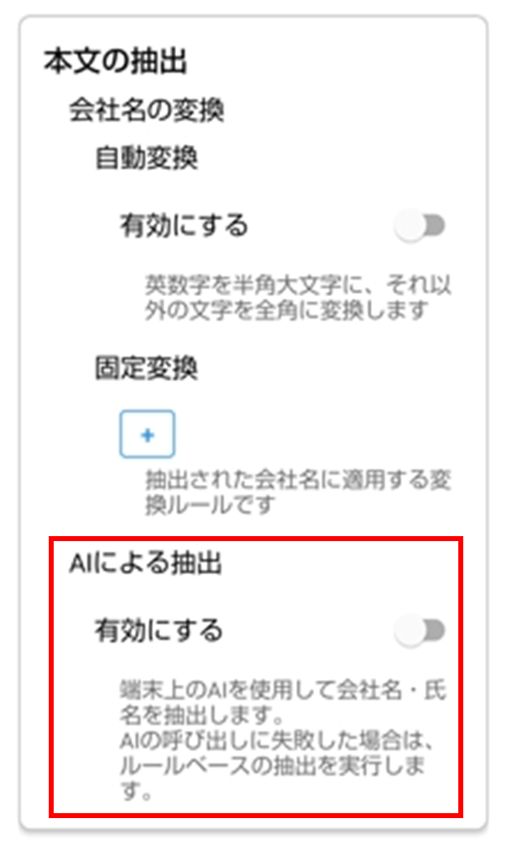

**ログ（自動更新）**

「有効にする」をONにすると、[ログの一覧画面](#ログの一覧画面)を開いている間、指定した更新間隔（秒）ごとに自動でログを再取得します。

  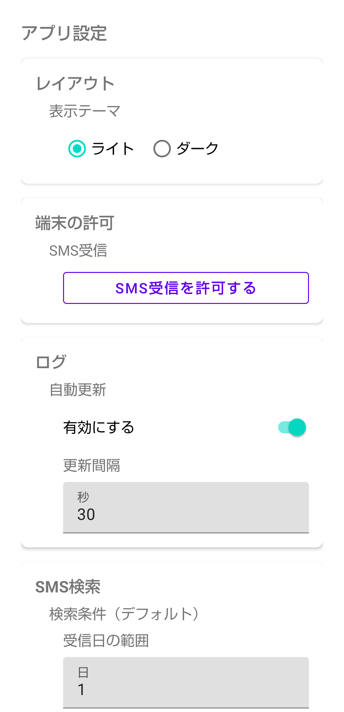

**ログ（統合範囲）**

自動送信のログはSMSの固有IDを持たないため、送信元と受信日時の近さでSMSと突き合わせます。その際の許容誤差（秒）です。[SMSの検索画面](#SMSの検索画面)の「送信状況」の各フィルタの精度に影響します。

  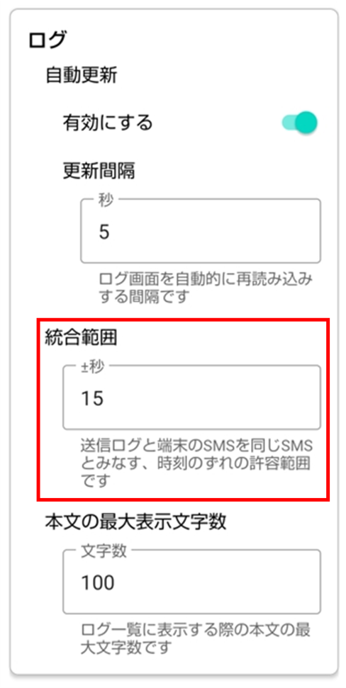

**ログ（本文の最大表示文字数）**

[ログの一覧画面](#ログの一覧画面)の一覧に表示する本文の最大文字数です。ここで指定した文字数を超える部分は表示されません。なお、長押しで確認できる抽出結果の詳細（会社名・氏名・本文）はこの設定と関係なく、常に本文全体が表示されます。

  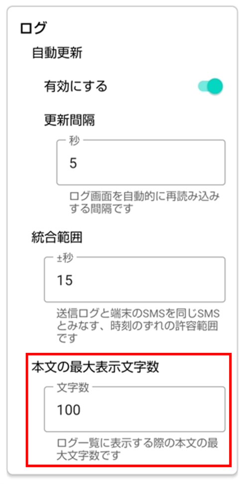

---

### 引き継ぎ情報の編集画面

[アプリの設定画面](#アプリの設定画面)の「SMSの引き継ぎ」にある「編集」ボタンから開く、引き継ぎ情報（送信元ごとに保持している最新の会社名・氏名）を個別に確認・編集・削除するための画面。

  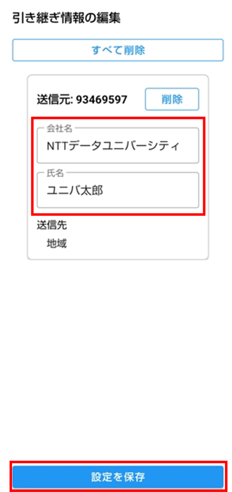

#### 機能一覧

- 項目の表示（送信元・会社名・氏名・送信先名）
- 項目の編集（会社名・氏名）
- 個別削除
- 全体削除
- 設定の保存

#### 機能の詳細

**項目の表示（送信元・会社名・氏名・送信先名）**

送信元（正規化した電話番号）ごとに1件の引き継ぎ情報が、日時が新しい順に表示されます。各引き継ぎ情報には以下が含まれます。

- 送信元（読み取り専用）
- 会社名・氏名（編集可能。詳細は次項「項目の編集」を参照）
- 送信先名：現在の会社名の内容を、現在の送信先のルール（[送信先の設定画面](#送信先の設定画面)の「送信先の振り分け」のキーワードと会社名との一致のみで判定し、本文の内容や「送信先の比較対象」の設定に関わらず常に会社名で判定します）に照らして判定した結果を表示します（読み取り専用）。一致する送信先が無い場合は「なし」と表示されます

引き継ぎ情報が1件も無い場合は「引き継ぎ情報がありません」と表示されます。

  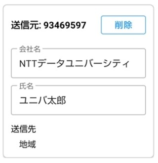

**項目の編集（会社名・氏名）**

各引き継ぎ情報の会社名・氏名は自由に書き換えられます。送信元と送信先名は読み取り専用で、この画面から編集することはできません。編集内容が実際に反映されるのは「設定を保存」を押した時点です。

  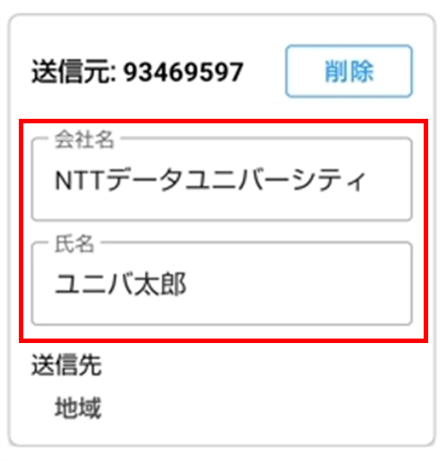

**個別削除**

各引き継ぎ情報の「削除」ボタンを押すと、その引き継ぎ情報が一覧から外れます。実際に削除されるのは「設定を保存」を押した時点です。

  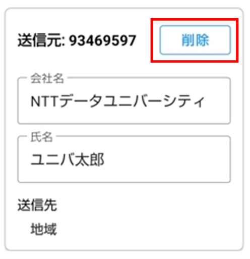

**全体削除**

「すべて削除」ボタンを押すと、表示中の全引き継ぎ情報が一覧から外れます。個別削除と同様、実際に削除されるのは「設定を保存」を押した時点です。

  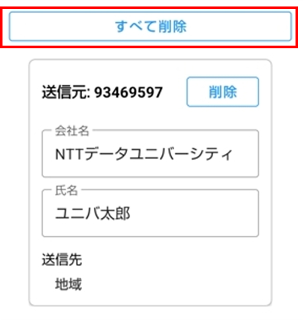

**設定の保存**

「設定を保存」ボタンを押すと、画面を開いてからの変更（会社名・氏名の編集、削除）を反映します。会社名・氏名のどちらかが空欄の引き継ぎ情報が残っている場合は保存されず、該当する送信元を示す入力エラーのダイアログが表示されます。画面を開いてから保存するまでの間に、SMSの受信などで内容が更新されていた場合も何も保存されず、「保存に失敗しました」というダイアログが表示されます（画面を開き直して編集をやり直してください）。

  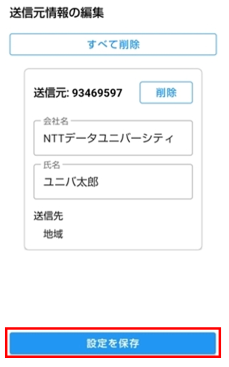

