# 操作マニュアル

## 本ツールについて

### 概要
　S2kは、受信したSMSをkintoneアプリのレコードとして保存（登録・更新）するアプリです。

### 動作環境
- 最小要件
  - Android 8.0（API 26）以降
  - メモリ：512 MB 以上
  - ストレージ空き容量：50 MB 以上（アプリ本体 10 MB + ログデータ保存用）

- その他の要件
  - 端末に「Google メッセージ」アプリがインストールされていること
  - 端末のSMSの読み取り・受信・送信の権限（詳細は[アプリの設定画面](#アプリの設定画面)の「端末の許可」を参照）
  - インターネット接続（kintoneへの登録に使用します）
  - kintone側：レコードを登録するアプリと、その接続情報（サブドメイン・認証情報・アプリID・フィールドコード）
  - （任意）本文の抽出にAIを使う場合：Pixel 8以降など、対応チップを搭載した端末

### 導入手順
1. アプリをインストールし、起動します
2. [アプリの設定画面](#アプリの設定画面)の「端末の許可」から、SMSの読み取り・受信・送信を許可します
3. [送信先の設定画面](#送信先の設定画面)で送信先を1件以上追加し、kintoneの接続情報（サブドメイン・認証情報・アプリID・フィールドコード）を入力して保存します
4. [アプリの設定画面](#アプリの設定画面)で、送信モード・返信モードなど運用に合わせた設定を行います
5. [トップ画面](#トップ画面)で、現在の送信モード・返信モードが意図した設定になっているか確認します

## 画面の構成について
### 画面の遷移

  

### 画面の一覧
- [トップ画面](#トップ画面)
- [SMSの検索画面](#SMSの検索画面)
- [ログの一覧画面](#ログの一覧画面)
- [送信先の設定画面](#送信先の設定画面)
- [アプリの設定画面](#アプリの設定画面)
- [引継ぎ内容の設定画面](#引継ぎ内容の設定画面)
- [設定のインポート・エクスポート画面](#設定のインポート・エクスポート画面)

## 各画面の詳細について
### トップ画面
　アプリ起動時に最初に表示される画面です。

  

#### 機能一覧 {#feature-list}
- [現在のモードの表示](#現在のモードの表示)
- [各画面への移動](#各画面への移動)

#### 機能の詳細 {#feature-details}
##### 現在のモードの表示
　画面上部に「SMSの送信モード」、その下に「SMSの返信モード」の見出しとともに、それぞれ「自動」または「手動」が表示されます。

- 送信モード 自動：受信したSMSを自動で送信する設定になっている状態
- 送信モード 手動：SMSの検索画面から手動で選んで送信する設定になっている状態
- 返信モード 自動：本文の抽出状況が異常なSMSを受信した際に、自動でSMSを返信する設定になっている状態
- 返信モード 手動：自動返信を行わない状態（返信はSMSの検索画面から手動で行います）

  

##### 各画面への移動
- 「SMSの検索」：[SMSの検索画面](#SMSの検索画面)を開きます。
- 「ログの確認」：[ログの一覧画面](#ログの一覧画面)を開きます。
- 「送信先の設定」：[送信先の設定画面](#送信先の設定画面)を開きます。
- 「アプリの設定」：[アプリの設定画面](#アプリの設定画面)を開きます。
- 「設定のインポート・エクスポート」：[設定のインポート・エクスポート画面](#設定のインポート・エクスポート画面)を開きます。

  

### SMSの検索画面
　受信済みのSMSを検索し、内容を確認したうえで手動でSMSを送信するための画面です。

  
  

> **注意**
> - 端末のSMSの読み取り権限（READ_SMS）が許可されていない場合、「アプリ設定画面の『端末の許可』の『SMSの読み取り』を許可してください」という案内文が表示されます。
>   - 権限の許可はアプリの設定画面の[端末の許可](#device-permissions)から行います。

#### 機能一覧 {#sms-search-feature-list}
- [検索条件の設定](#検索条件の設定)
- [検索条件の表示・非表示の切り替え](#検索条件の表示・非表示の切り替え)
- [SMSの検索](#SMSの検索)
- [SMS一覧の更新](#SMS一覧の更新)
- [SMSの返信](#SMSの返信)
- [SMSの送信](#SMSの送信)
- [全選択／選択解除](#全選択／選択解除)

#### 機能の詳細 {#sms-search-feature-details}
##### 検索条件の設定
- 開始日／終了日
  - それぞれタップするとカレンダーが開き、日付を選べます。
- 送信先
  - 特定の送信先に一致するSMSだけに絞り込めます。
  - 「すべて」の他、設定済みの送信先名、「なし」（どの送信先にも一致しないSMS）を選べます。
  - 送信先が1件しか設定されていない場合は、絞り込んでも結果が変わらないためこの項目自体が表示されません。
- 抽出状況
  - 正常：本文から会社名・氏名を抽出できた
  - 異常：本文から会社名・氏名を抽出できなかった
- 送信状況
  - 未：送信前のSMS
  - 済（自動）：自動で送信されたSMS
  - 済（手動）：手動で送信されたSMS

  

##### 検索条件の表示・非表示の切り替え
　検索条件の入力欄をまとめて隠す／表示を切り替えることができます。

  
  

##### SMSの検索 {#search}
　受信ボックスから検索条件に該当するSMSを取得し、一覧で表示します。

- アイコン
  - 抽出対象：SMS・ストレージ
  - 抽出状況：正常・異常
  - 送信状況：未送信・自動送信済み・手動送信済み
  - 返信状況：自動返信済み
  - 送信先の存在：あり・なし
- 送信先名
- 受信日時と送信元
- 本文全体
- 送信結果の背景色
  - 未送信：なし
  - 自動送信済み：青系
  - 手動送信済み：アンバー系
  - 送信失敗：赤系

  
  

##### SMS一覧の更新
　一覧を下に引っ張ると、現在の検索条件で再検索されます。

  

##### SMSの返信 {#sms-reply}
　SMSを長押しすると、標準のSMSアプリの返信画面が開き、[アプリの設定画面](#アプリの設定画面)で設定した文言が自動で入力されます。

  

##### SMSの送信 {#sms-send}
　選択したSMSをkintoneに送信します。 
　完了すると成功・失敗件数がメッセージで表示され、一覧が自動的に更新されます。

  

> **注意**
> - 送信先名が「なし」のSMSはで選択できません。

##### 全選択／選択解除
　SMSのチェックボックスを、まとめて操作（ON／OFF）することができます。

  
  

### ログの一覧画面
　SMSの受信・SMSの送信・SMSの返信の履歴を確認するための画面です。

  

#### 機能一覧 {#log-feature-list}
- [ログの一覧表示](#ログの一覧表示)
- [ログの更新](#ログの更新)
- [ログの削除](#ログの削除)
- [抽出結果の表示](#抽出結果の表示)

#### 機能の詳細 {#log-feature-details}
##### ログの一覧表示
　ログ（受信・送信・返信）を、一覧で表示します。
- ログの種別（受信完了／送信開始／送信完了／返信完了）と記録日時
- 結果（成功／失敗）とメッセージ（緑＝成功、赤＝失敗）
- アイコン
  - 抽出対象：SMS・ストレージ
  - 抽出状況：正常・異常
  - 送信状況：未送信・自動送信済み・手動送信済み
  - 返信状況：自動返信済み
  - 送信先の存在：あり・なし
- 送信先名
- 受信日時と送信元
- 本文全体

  

##### ログの更新
　「更新」ボタン、または一覧を下に引っ張ることで、最新のログを表示します。

  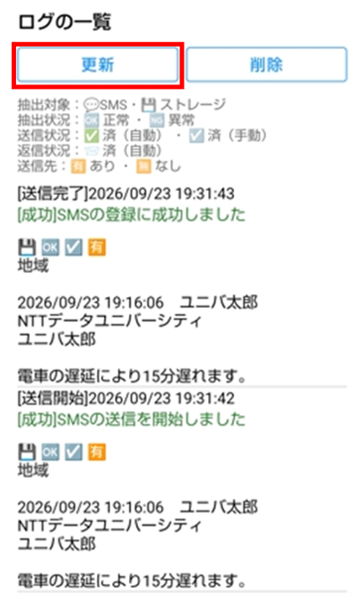
  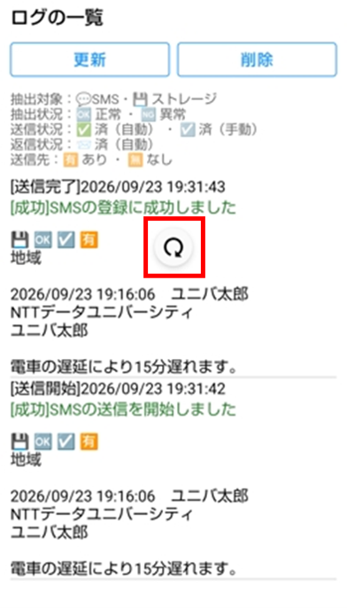

##### ログの削除
　ログを削除することができます。

  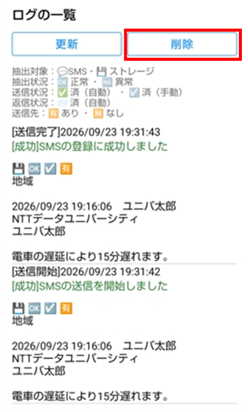
  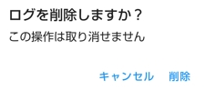

##### 抽出結果の表示
　ログを長押しすると、SMSの抽出結果をダイアログで確認できます。 

- アイコン
  - 抽出方法:ルールベース／AI
  - 会社名の変換:ある／なし
- 会社名
- 氏名
- 本文

  

### 送信先の設定画面
　SMSの送信先を設定する画面です。

  

#### 機能一覧 {#send-target-feature-list}
- [送信先の追加](#送信先の追加)
- [送信先のコピー](#送信先のコピー)
- [送信先の削除](#送信先の削除)
- [送信先の設定（基本の設定）](#送信先の設定（基本の設定）)
- [送信先の設定（kintoneの設定）](#送信先の設定（kintoneの設定）)
- [送信先のテスト](#送信先のテスト)
- [送信先の保存](#send-target-settings-save)

#### 機能の詳細 {#send-target-feature-details}
##### 送信先の追加
　新しい送信先の設定を追加します。 
　新しい送信先の見出しには「設定 1」「設定 2」のように連番が表示されます。

  

##### 送信先のコピー
　その送信先の内容を複製し、新しい送信先の設定を追加します。 
　送信先名の末尾に「のコピー」が付きます。

  

##### 送信先の削除
　送信先の設定を削除します。

  

##### 送信先の設定（基本の設定）
　送信先の名前や振り分けの際のルールを変更できます。
###### 設定項目 {#send-target-basic-config-items}
- 送信先
  - 送信先名
    - 一覧や履歴で表示される名前
  - 会社名
    - 送信先の会社名
  - 送信先の振り分け
    - この送信先を使う条件となる、会社名に含まれる文字列
    - 「+」で行を追加、「×」で行を削除し、複数指定できます。

  

> **注意**
> - 設定内容は、「設定を保存」を押した時点で反映されます。
> - 会社名の表示
>   - 「会社名の抽出」が有効な場合のみ表示されます。
> - 送信先の振り分けの表示
>   - 「会社名の抽出」が有効な場合のみ表示されます。
> - 送信先の振り分けがない場合の扱い
>   - デフォルトの送信先として扱われます。

##### 送信先の設定（kintoneの設定）
　送信先のkintoneのサブドメインや認証情報を変更できます。

###### 設定項目 {#send-target-kintone-config-items}
- 接続先
  - サブドメイン
    - kintoneのサブドメイン（URLの一部）
- 認証情報
  - ログイン名
    - kintoneのログイン名
  - パスワード
    - kintoneのパスワード
- 連絡用のアプリ
  - アプリID
    - 登録先となるkintoneアプリのID
    - フィールドコード
      - アプリのkintoneのフィールドコード
        - 登録種別・受信日時・送信元・会社名・氏名・本文・履歴
- 統合条件
  - 既存レコードを更新する条件
    - 同一日付：最終受信日時の日付が同じ場合に更新します。
    - 時間：指定した時間以内の場合に更新します。
- 統合範囲
  - 「統合条件」を時間にした場合の許容時間（±時間）

  
  

> **注意**
> - 設定内容は、「設定を保存」を押した時点で反映されます。

##### 送信先のテスト
　送信先の設定を使用して、kintoneへの送信をテストできます。

  

###### テストデータ
　初期値は設定に応じて変わります。

- 抽出が有効な場合
  - 1行目（会社名）：テスト用の会社名（振り分けのキーワードが設定されていればそのキーワード、複数ある場合は「、」で連結したもの、未設定なら「NTTデータ○○○」）
  - 2行目（氏名）：「テスト太郎」
  - 3行目（内容）：「これはアプリからのテスト送信です」
- 抽出が無効な場合
  - 1行目（氏名）：「テスト太郎」
  - 2行目以降（内容）：「これはアプリからのテスト送信です」

  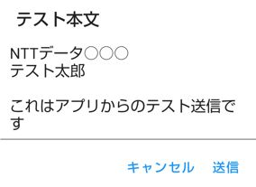
  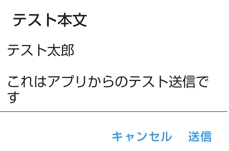

###### テスト結果の表示
**成功の場合**

  

**失敗の場合**

  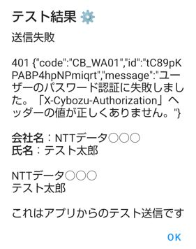

##### 送信先の保存 {#send-target-settings-save}
　すべての送信先の設定を保存します。

  

> **注意**
> - 送信先名・サブドメイン・認証情報（ログイン名・パスワード）・アプリID・フィールドコード（送信元・履歴・受信日時・登録種別）のいずれかが未入力の場合、保存は行われません。

### アプリの設定画面
　アプリ全体の動作（端末の権限、送信モード、返信モードなど）を設定する画面です。

  

#### 機能一覧 {#app-settings-feature-list}
- [設定の初期化](#設定の初期化)
- [端末の権限](#device-permissions)
- [レイアウト](#レイアウト)
- [SMSの検索](#SMSの検索)
- [SMSの送信](#SMSの送信)
- [SMSの返信](#SMSの返信)
- [SMSの情報抽出](#SMSの情報抽出)
- [SMSの引継ぎ](#SMSの引継ぎ)
- [ログ](#ログ)

#### 機能の詳細 {#app-settings-feature-details}
##### 設定の初期化
　このアプリの設定画面の内容を初期状態に戻します。

  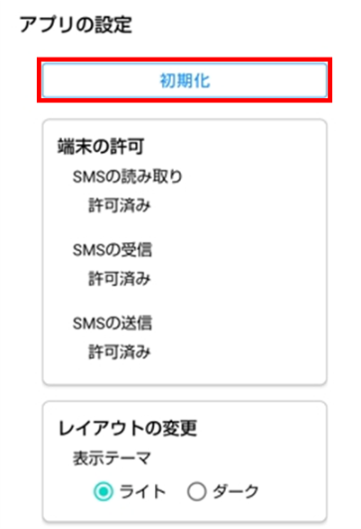

##### 端末の権限 {#device-permissions}
　端末の権限を変更できます。

  
  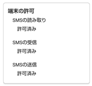

> **注意**
> - SMSの操作（SMS検索・自動送信・自動返信）に使用します。 
> - すでに許可されている場合は「許可済み」と表示され、ボタンと説明文は隠れます。

##### レイアウト
　アプリのレイアウトを変更できます。

###### 設定項目 {#layout-config-items}
- 表示テーマ
  - アプリのテーマを変更できます。

  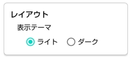

##### SMSの検索
　[SMSの検索画面](#SMSの検索画面)を開いたときの、デフォルトの検索条件や選択の対象を変更できます。

###### 設定項目 {#sms-search-config-items}
- 検索条件の初期値
  - 受信日の範囲
    - 開始日を「今日から何日前」にするかを指定します（1を指定すると開始日・終了日ともに今日になります）
  - 送信先
    - デフォルトで絞り込む送信先を選びます（「すべて」「なし」も選択可能）。
      - 送信先が1件しか設定されていない場合は、この項目自体が表示されません。
  - 送信状況
    - デフォルトでONにするかどうか
  - 抽出状況
    - デフォルトでONにするかどうか
- 検索条件の表示
  - デフォルトで表示するかどうか
- SMS選択の対象
  - 抽出状況が異常
    - 選択対象のSMSとして有効にするかどうか

  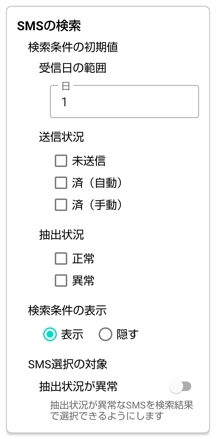

##### SMSの送信 {#app-settings-sms-send}
　SMS送信の自動送信の切り替えや自動送信の対象のSMSなどを変更できます。

###### 設定項目 {#sms-send-config-items}
- 送信モード
  - 自動送信の有効・無効
- 自動送信の対象
  - 抽出状況が異常
    - 自動送信対象のSMSとして有効にするかどうか

  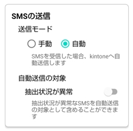

##### SMSの返信 {#app-settings-sms-reply}
　SMS送信の自動返信の切り替えや返信メッセージなどを変更できます。

###### 設定項目 {#sms-reply-config-items}
- 返信モード
  - 自動返信の有効・無効
- 自動送信の間隔
  - 同じ送信元へ再度返信するまでの間隔
- 返信メッセージ
  - 返信用のSMSのデフォルトの文言
    - 正しく抽出できた場合
      - 抽出状況が正常なSMSに返信する場合の文言
    - 正しく抽出でなかった場合
      - 抽出状況が異常なSMSに返信する場合の文言

  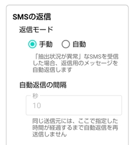
  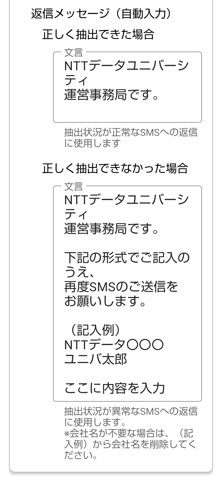

##### SMSの情報抽出
　抽出の対象や抽出後の変換などを変更できます。

###### 設定項目 {#sms-extraction-config-items}
- 会社名の抽出
  - 本文の1行目を「会社名」または「氏名」として扱うかどうか
- 会社名の変換
  - 抽出後の会社名の変換ルール
  - 自動変換
    - 英数字を半角大文字に、それ以外の文字を全角に統一する変換をするかどうか
  - 固定変換
    - 固定の文字列に置き換える文字列（変換前→変換後）
      - 複数設定した場合は上から順に適用されます。
      - 「+」で行を追加、「×」で行を削除します。
- AIによる抽出
  - 端末上のAIを使用して抽出をするかどうか　

  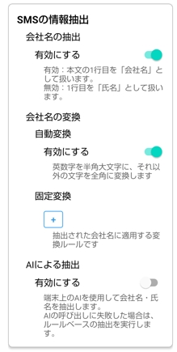

> **注意**
> - 自動変換と固定変換を併用している場合、固定変換は自動変換後の値に適用されます。
> - 「会社名の抽出」を有効にした場合
>   - 会社名がない引継ぎ内容がある場合は警告ダイアログが表示され、会社名がない件数が表示されます。 
>   - ダイアログが表示された場合は、[SMSの引継ぎ](#SMSの引継ぎ)画面で会社名を追加してください。
> - 「AIによる抽出」を有効にした場合
>   - 対応端末（Pixel 8以降など、対応チップを搭載した一部の機種のみ）が無い場合や、AIの呼び出しに失敗した場合は、自動的にルールベースの解析にフォールバックします。

##### SMSの引継ぎ
　SMSの引継ぎの有効・無効や引継ぎ内容を変更できます。

###### 設定項目 {#sms-continuation-config-items}
- 引継ぎ
  - 引継ぎの有効・無効
- 引継ぎの範囲
  - 引継ぎの範囲
    - 制限なし
      - 過去の引継ぎ内容を永続的に利用します。
    - 同一日のみ
      - 引継ぎ内容を日ごとにリセットします。
- 引継ぎ内容の表示
  - 電話番号を氏名として表示するかどうか

　「引継ぎ内容の設定」ボタンについては、後述の[引継ぎ内容の設定画面](#引継ぎ内容の設定画面)を確認してください。

  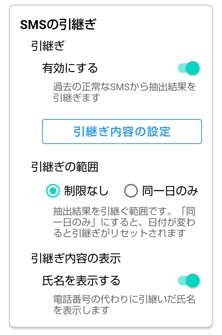

##### ログ
　ログの自動更新や統合範囲などを変更できます。

###### 設定項目 {#log-config-items}
- 自動更新
  - 自動更新の有効・無効
  - 更新間隔
    - 自動更新の間隔（秒）
- 統合範囲
  - 送信元と受信日時の近さでSMSと突き合わせをする際の許容誤差（秒）
- 本文の最大表示文字数
  - 一覧に表示する本文の最大表示文字数

  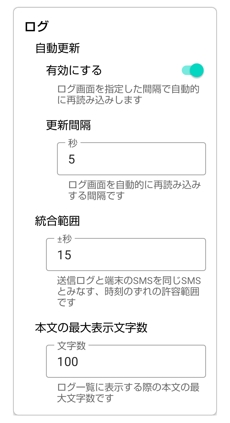

### 引継ぎ内容の設定画面
　引継ぎ内容を個別に確認・編集・削除するための画面です。

  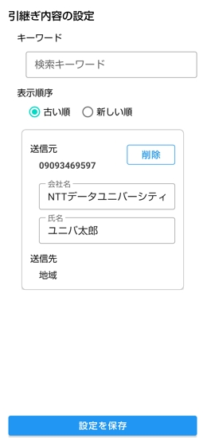

#### 機能一覧 {#continuation-feature-list}
- [引継ぎ内容の検索](#引継ぎ内容の検索)
- [引継ぎ内容の並び替え](#引継ぎ内容の並び替え)
- [引継ぎ内容の一覧表示](#引継ぎ内容の一覧表示)
- [引継ぎ内容の編集](#引継ぎ内容の編集)
- [引継ぎ内容の削除](#引継ぎ内容の削除)
- [引継ぎ内容の保存](#continuation-save)

#### 機能の詳細 {#continuation-feature-details}
##### 引継ぎ内容の検索 {#continuation-search}
　画面上部の検索欄に、キーワードを入力すると、入力した文字が含まれる送信元情報だけが一覧に表示されます。検索は大文字小文字・半角全角を区別しません（「ＡＢＣ」と「abc」は同じものとして検索されます）。

  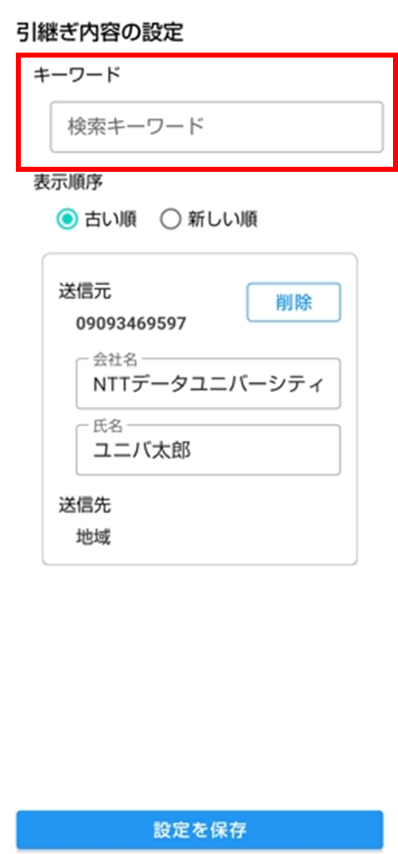

##### 引継ぎ内容の並び替え
　引継ぎ内容を並び替えることができます。

- 「古い順」：登録日時が古い順に表示します（デフォルト）
- 「新しい順」：登録日時が新しい順に表示します

  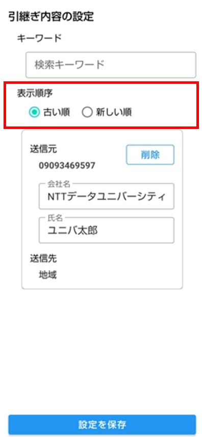

##### 引継ぎ内容の一覧表示
　引継ぎ内容を、一覧で表示します。

- 送信元
- 会社名
- 氏名
- 送信先名

  
  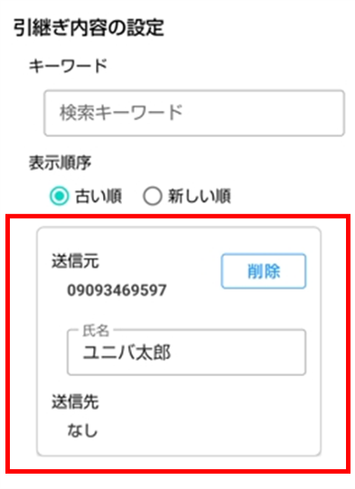

> **注意**
> - 会社名の表示
>   - 「会社名の抽出」が有効な場合のみ表示されます。

##### 引継ぎ内容の編集
　会社名・氏名を変更できます。

  
  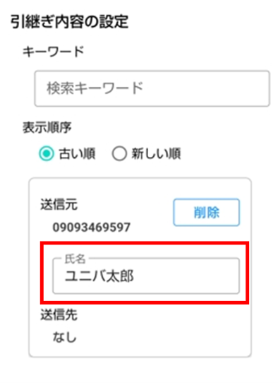

> **注意**
> - 会社名の表示
>   - 「会社名の抽出」が有効な場合のみ表示されます。
> - 編集内容は、「設定を保存」を押した時点で反映されます。

##### 引継ぎ内容の削除
　引継ぎ内容の一覧から削除することができます。

  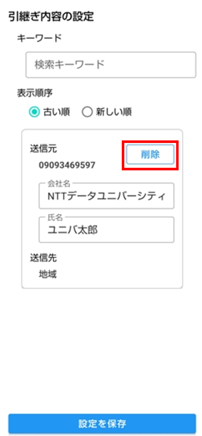

> **注意**
> - 削除内容は、「設定を保存」を押した時点で反映されます。

##### 引継ぎ内容の保存 {#continuation-save}
　編集内容を保存します。

  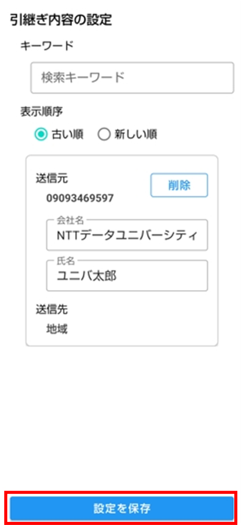

> **注意**
> - 会社名・氏名が空欄の場合、保存は行われません。
>   - 会社名は、「会社名の抽出」が有効な場合のみ必須になります。

### 設定のインポート・エクスポート画面
　アプリの設定・送信先の設定・引継ぎ内容を、JSONファイルへまとめて書き出したり、JSONファイルからまとめて反映したりするための画面です。 
　端末を変更するときや、設定を他の端末へ移行するときに使います。

  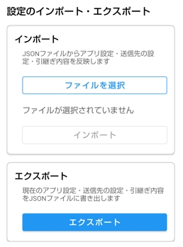

#### 機能一覧 {#import-export-feature-list}
- 設定のインポート
  - [設定のファイル選択](#設定のインポート（ファイル選択）)
  - [設定のインポート](#設定のインポート（インポート）)
- [設定のエクスポート](#設定のエクスポート)

#### 機能の詳細 {#import-export-feature-details}
##### 設定のインポート（ファイル選択）
　ファイルに記載された内容を取得します。 
　「ファイルを選択」を押してJSONファイルを選ぶと、ファイルに含まれる各設定の反映内容が表示されます。

  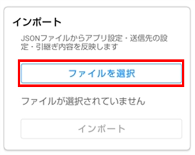
  

##### 設定のインポート（インポート）
　ファイルの内容を設定として反映します。

  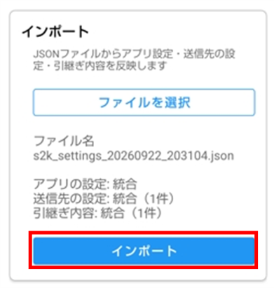

> **注意**
> - 反映されるのはファイルに含まれる内容だけです。
>   - 含まれていない内容は変更されません。

##### 設定のエクスポート
　現在の設定（「アプリの設定」・「送信先の設定」・「引継ぎ内容の設定」）を、インポートできるJSONファイルとしてまとめて書き出します。
- ファイル名の初期値：s2k_settings_日時.json

  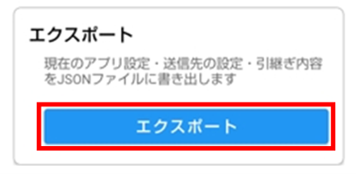

