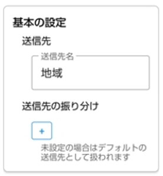
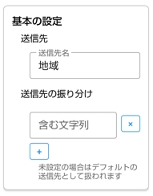
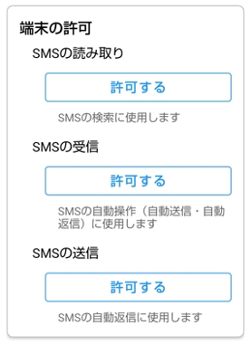
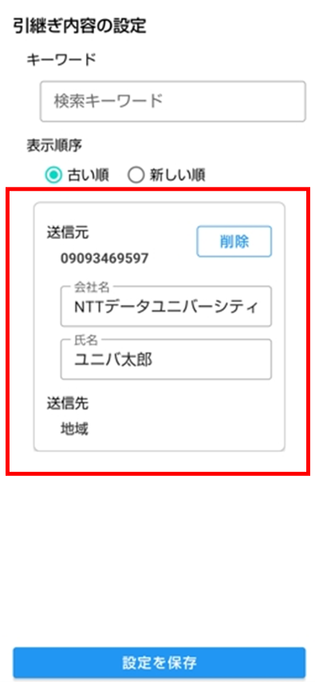
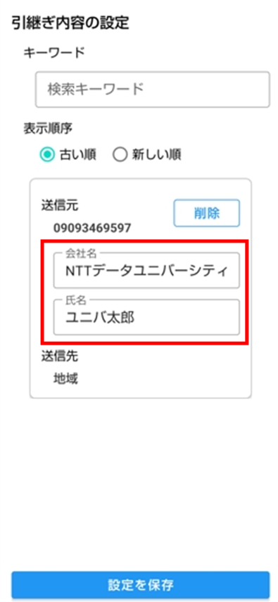

# 操作マニュアル

## 本ツールについて

### 概要
　S2kは、受信したSMSをkintoneアプリのレコードとして保存（登録・更新）するアプリです。

### 動作環境

**最小要件：**
- Android 8.0（API 26）以降
- メモリ：512 MB 以上
- ストレージ空き容量：50 MB 以上（アプリ本体 10 MB + ログデータ保存用）

**推奨環境：**
- Android 11 以上
- メモリ：2 GB 以上
- ストレージ空き容量：100 MB 以上

**その他の要件：**
- 端末に「Google メッセージ」アプリがインストールされていること
- 端末のSMSの読み取り・受信・送信の権限（詳細は[アプリの設定画面](#アプリの設定画面)の「端末の許可」を参照）
- インターネット接続（kintoneへの登録に使用します）
- kintone側：レコードを登録するアプリと、その接続情報（サブドメイン・認証情報・アプリID・フィールドコード）
- （任意）本文の抽出にAIを使う場合：Pixel 8以降など、対応チップを搭載した端末

### 導入手順

1. アプリをインストールし、起動します
2. [アプリの設定画面](#アプリの設定画面)の「端末の許可」から、SMSの読み取り・受信・送信を許可します
3. [送信先の設定画面](#送信先の設定画面)で送信先を1件以上追加し、kintoneの接続情報（サブドメイン・認証情報・アプリID・フィールドコード）を入力して保存します
4. [アプリの設定画面](#アプリの設定画面)で、送信モード・返信モードなど運用に合わせた設定を行います
5. [トップ画面](#トップ画面)で、現在の送信モード・返信モードが意図した設定になっているか確認します

## 画面の構成について

### 画面の遷移

  

### 画面の一覧

- [トップ画面](#トップ画面)
- [SMSの検索画面](#SMSの検索画面)
- [ログの一覧画面](#ログの一覧画面)
- [送信先の設定画面](#送信先の設定画面)
- [アプリの設定画面](#アプリの設定画面)
- [引継ぎ内容の設定画面](#引継ぎ内容の設定画面)
- [設定のインポート・エクスポート画面](#設定のインポート・エクスポート画面)

## 各画面の詳細について

### トップ画面

　アプリ起動時に最初に表示される画面です。

  

#### 機能一覧

- [現在のモードの表示](#現在のモードの表示)
- [各画面への移動](#各画面への移動)
  - SMSの検索
  - ログの確認
  - 送信先の設定
  - アプリの設定
  - 設定のインポート・エクスポート

#### 機能の詳細

##### 現在のモードの表示

　画面上部に「SMSの送信モード」、その下に「SMSの返信モード」の見出しとともに、それぞれ「自動」または「手動」が表示されます。

- 送信モード 自動：受信したSMSを自動で送信する設定になっている状態
- 送信モード 手動：SMSの検索画面から手動で選んで送信する設定になっている状態
- 返信モード 自動：本文の抽出状況が異常なSMSを受信した際に、自動でSMSを返信する設定になっている状態
- 返信モード 手動：自動返信を行わない状態（返信はSMSの検索画面から手動で行います）

  

##### 各画面への移動

- 「SMSの検索」：[SMSの検索画面](#SMSの検索画面)を開きます。受信済みのSMSを検索し、手動でSMSを送信することができます。
- 「ログの確認」：[ログの一覧画面](#ログの一覧画面)を開きます。SMSの受信・送信・返信の履歴を確認できます。
- 「送信先の設定」：[送信先の設定画面](#送信先の設定画面)を開きます。SMSの送信先を設定します。
- 「アプリの設定」：[アプリの設定画面](#アプリの設定画面)を開きます。送信モードや自動更新間隔など、アプリ全体の動作を設定します。
- 「設定のインポート・エクスポート」：[設定のインポート・エクスポート画面](#設定のインポート・エクスポート画面)を開きます。設定全体をJSONファイルへ書き出したり、JSONファイルからまとめて反映したりします。

  

### SMSの検索画面

　受信済みのSMSを検索し、内容を確認したうえで手動でSMSを送信するための画面です。

  

#### 機能一覧

- [端末の権限の案内表示](#端末の権限の案内表示)
- [検索条件の表示・非表示の切り替え](#検索条件の表示・非表示の切り替え)
- [検索条件](#検索条件)
- [検索](#検索)
- [SMSの一覧表示](#SMSの一覧表示)
- [SMS一覧の更新](#SMS一覧の更新)
- [SMSの返信](#SMSの返信)
- [SMSの送信](#SMSの送信)
- [全選択／選択解除](#全選択／選択解除)

#### 機能の詳細

##### 端末の権限の案内表示

　端末のSMSの読み取り権限（READ_SMS）が許可されていない場合、検索条件や一覧の代わりに「アプリ設定画面の『端末の許可』の『SMSの読み取り』を許可してください」という案内文が表示されます。 
　権限の許可は[アプリの設定画面](#アプリの設定画面)の「端末の許可」から行います。 
　許可すると、この画面を開き直したときに通常の画面に切り替わります。

  

##### 検索条件の表示・非表示の切り替え

　見出し「検索条件」の右にあるボタンで、検索条件の入力欄をまとめて隠す／表示できます。

  
  

##### 検索条件

- 開始日／終了日
  - それぞれタップするとカレンダーが開き、日付を選べます。
- 送信先
  - 特定の送信先に一致するSMSだけに絞り込めます。
  - 「すべて」の他、設定済みの送信先名、「なし」（どの送信先にも一致しないSMS）を選べます。
  - 送信先が1件しか設定されていない場合は、絞り込んでも結果が変わらないためこの項目自体が表示されません。
- 抽出状況
  - 正常：本文から会社名・氏名を抽出できた
  - 異常：本文から会社名・氏名を抽出できなかった
- 送信状況
  - 未：送信前のSMS
  - 済（自動）：自動で送信されたSMS
  - 済（手動）：手動で送信されたSMS

  

##### 検索

　「検索」ボタンを押すと、受信ボックスから上記の条件に該当するSMSを検索し、一覧に表示します。 
　画面を開いた直後や、下に引っ張って更新したときも、同じ条件で自動的に検索されます。

  

##### SMSの一覧表示

　各SMSは以下の内容が1件ずつ表示されます。

- アイコン
  - 抽出対象：SMS・ストレージ
  - 抽出状況：正常・異常
  - 送信状況：未送信・自動送信済み・手動送信済み
  - 返信状況：自動返信済み
  - 送信先の存在：あり・なし
- 送信先名
- 受信日時と送信元
- 本文全体
- 送信結果の背景色
  - 未送信：なし
  - 自動送信済み：青系
  - 手動送信済み：アンバー系
  - 送信失敗：赤系

　送信先名が「なし」のSMSはチェックボックスで選択できません。 
　本文の抽出状況が異常なSMSについては、チェックボックスで選択できるかどうかを[アプリの設定画面](#アプリの設定画面)の「SMS選択の対象」で切り替えられます。

  

##### SMS一覧の更新

　一覧を下に引っ張ると、現在の検索条件でその場で再検索されます。

  

##### SMSの返信

　1件のSMSを長押しすると、標準のSMSアプリの返信画面が開き、[アプリの設定画面](#アプリの設定画面)で設定した文言（本文の抽出状況が異常な場合は専用の文言）が自動で入力されます。

  

##### SMSの送信

　チェックを付けたSMSを「選択したSMSを送信」ボタンで送信します。 
　一覧の表示順（受信日時が新しい順）に関わらず、送信自体は受信日時が古いものから順に1件ずつ処理されます。 
　完了すると成功・失敗件数がメッセージで表示され、一覧が自動的に更新されます。

  

##### 全選択／選択解除

　一覧に表示されているSMSのチェックボックスを、まとめてON／OFFできます。 
　選択できない状態（グレーアウト）のSMSは対象になりません。

  
  

### ログの一覧画面

　SMSの受信・SMSの送信・SMSの返信の履歴を確認するための画面です。

  

#### 機能一覧

- [ログの一覧表示](#ログの一覧表示)
- [ログの手動更新](#ログの手動更新)
- [ログの自動更新](#ログの自動更新)
- [ログのクリア](#ログのクリア)
- [抽出結果の表示](#抽出結果の表示)

#### 機能の詳細

##### ログの一覧表示

　ログは新しいものから順に、1件ずつ以下の内容が表示されます。

- ログの種別（受信完了／送信開始／送信完了／返信完了）と記録日時
- 結果（成功／失敗）とメッセージ（緑＝成功、赤＝失敗）
- アイコン
  - 抽出対象：SMS・ストレージ
  - 抽出状況：正常・異常
  - 送信状況：未送信・自動送信済み・手動送信済み
  - 返信状況：自動返信済み
  - 送信先の存在：あり・なし
- 送信先名
- 受信日時と送信元
- 本文全体

  

##### ログの手動更新

　「更新」ボタン、または一覧を下に引っ張ることで、その時点の最新のログを表示し直します。

  
  

##### ログの自動更新

　[アプリの設定画面](#アプリの設定画面)で「自動更新」を有効にしている場合、画面を開いている間は設定した更新間隔（秒）ごとに自動で最新のログを再取得します。

##### ログのクリア

　「ログをクリアしますか？」の確認ダイアログが表示され、「この操作は取り消せません」という警告メッセージとともに表示されます。「クリア」を押すとログが全件削除されます。

  
  

##### 抽出結果の表示

　ログを長押しすると、そのエントリの内容をダイアログで確認できます。 
　本文の抽出が正常に行われたエントリでは、送信した会社名（会社名の変換を行った場合は変換後の値）・氏名・本文を表示します。本文の抽出が異常だったエントリでは「会社名・氏名の抽出に失敗しています」というメッセージを、返信完了のエントリでは送信した返信内容を表示します。 
　ダイアログのタイトル末尾には、その抽出にAIを使ったか、ルールベースを使ったかを示すアイコンが表示されます。会社名の変換を行った場合は、さらにその右に変換のマークが付きます。

  

### 送信先の設定画面

　SMSの送信先を設定する画面です。

  

#### 機能一覧

- [送信先の追加](#送信先の追加)
- [送信先のコピー](#送信先のコピー)
- [送信先の削除](#送信先の削除)
- 送信先の設定
  - [基本の設定](#送信先の設定（基本の設定）)
  - [kintoneの設定](#送信先の設定（kintoneの設定）)
- [テスト送信](#テスト送信)
- [設定の保存](#設定の保存-送信先の設定画面)

#### 機能の詳細

##### 送信先の追加

　新しい送信先の設定を一番下に追加します。 
　各送信先の見出しには「設定 1」「設定 2」のように連番が表示されます。

  

##### 送信先のコピー

　その送信先の内容を複製し、新しい送信先として追加します（送信先名の末尾に「のコピー」が付きます）。

  

##### 送信先の削除

　その送信先の設定を削除します。

  

##### 送信先の設定（基本の設定）
　送信先の名前や振り分けの際のルールを設定します。

###### 設定項目

- 送信先
  - 送信先名
    - 一覧や履歴で表示される名前を設定します。
  - 会社名
    - 送信先の「会社名」を設定します。
      - [アプリの設定画面](#アプリの設定画面)の「SMSの情報抽出（会社名の抽出）」が無効な場合に表示されます。
- 送信先の振り分け
　- この送信先を使う条件となる、会社名に含まれる文字列を設定します。
  - 本文から抽出した会社名にこの文字列が含まれるかどうかで判定します。
  - この入力欄は「会社名の抽出」が有効な場合のみ表示されます（「会社名の抽出」が無効な場合は振り分けに使われません）。
    - 「+」で行を追加、「×」で行を削除でき、複数指定できます。
    - 空欄の場合は、どの文字列にも一致しなかったときのデフォルトの送信先として扱われます。
    - 複数の送信先の条件に同時に一致した場合は、その全ての送信先へ登録されます。

  
  

##### 送信先の設定（kintoneの設定）

　送信先のkintoneのサブドメインや認証情報を設定します。

###### 設定項目
- 接続先
  - サブドメイン
    - kontoneのサブドメイン（URLの一部）を設定します。
- 認証情報
  - ログイン名
    - kontoneのログイン名を設定します。
  - パスワード
    - kontoneのパスワードを設定します。
- 連絡用のアプリ
  - アプリID
    - 登録先となるkintoneアプリのIDを設定します。
    - フィールドコード
      - アプリのkintoneのフィールドコードを設定します。
        - 登録種別・受信日時・送信元・会社名・氏名・本文・履歴
- 統合条件
  - 新規登録ではなく既存レコードを更新する条件を設定します。
    - 同一日付：最終受信日時の日付が同じ場合に更新します。
    - 時間：指定した時間以内の場合に更新します。
- 統合範囲
  - 許容時間（±時間）を設定します。

  
  

##### テスト送信

　「テスト送信」ボタンを押すと、その場でkintoneへ実際に送信を試せます。

  

テストの実施:

- テストデータの送信

　テスト送信を押すと本文の入力欄が表示されます。初期値は設定に応じて変わります。本文の抽出が有効な場合は、1行目に会社名としてテスト用の会社名（振り分けのキーワードが設定されていればそのキーワード、複数ある場合は「、」で連結したもの、未設定なら「NTTデータ○○○」）、2行目に氏名として「テスト太郎」が入ります。無効な場合は、1行目に氏名として「テスト太郎」が入り、2行目以降に「これはアプリからのテスト送信です」というメッセージが入ります。編集してそのまま送信内容を確認できます。

  

- テストの成功

  

- テストの失敗

  

##### 設定の保存 {#設定の保存-送信先の設定画面}

　「設定を保存」ボタンは画面下部に固定表示されており、押すと、すべての送信先の入力内容を検証します。 
　送信先が1件もない場合は「設定を1つ以上追加してください」というメッセージが表示され、保存は行われません。 
　送信先名・サブドメイン・認証情報（ログイン名・パスワード）・アプリID・フィールドコード（送信元・履歴・受信日時・登録種別）のいずれかが未入力の送信先がある場合も、その送信先名（または番号）を示すエラーダイアログが表示され、保存は行われません。 
　すべて問題なければ保存され、トップ画面へ戻ります。

  

### アプリの設定画面

　アプリ全体の動作（端末の権限、送信モード、返信モード、ログの自動更新、SMSの検索のデフォルト条件など）を設定する画面です。

  

#### 機能一覧

- [設定の初期化](#設定の初期化)
- [端末の許可](#端末の許可)
- [レイアウトの変更](#レイアウトの変更)
- [SMSの検索](#SMSの検索)
- [SMSの送信](#SMSの返信)
- [SMSの返信](#SMSの返信)
- [SMSの情報抽出](#SMSの情報抽出)
- [SMSの引継ぎ](#SMSの引継ぎ)
  - [引継ぎ内容の設定](#SMSの引継ぎ（引継ぎ内容の設定）)
- ログ
  - [自動更新](#ログ（自動更新）)
  - [統合範囲](#ログ（統合範囲）)
  - [本文の最大表示文字数](#ログ（本文の最大表示文字数）)

#### 機能の詳細

##### 設定の初期化

　このアプリの設定画面の内容を初期状態に戻します。

  

##### 端末の許可
　SMSの操作（SMS検索・自動送信・自動返信）に使用します。 
　すでに許可されている場合は「許可済み」と表示され、ボタンと説明文は隠れます。

  

##### レイアウトの変更
　アプリのレイアウトを設定します。

###### 設定項目
- 表示テーマ
  - レイアウトとのテーマを設定します。

  

##### SMSの検索

　[SMSの検索画面](#SMSの検索画面)を開いたときの、デフォルトの検索条件や選択の対象を設定します。

###### 設定項目
- 検索条件の初期値
  - 受信日の範囲
    - 開始日を「今日から何日前」にするかを指定します（1を指定すると開始日・終了日ともに今日になります）
  - 送信先
    - デフォルトで絞り込む送信先を選びます（「すべて」「なし」も選択可能）。
      - 送信先が1件しか設定されていない場合は、この項目自体が表示されません。
  - 送信状況
    - 初期状態でONにするかどうかを設定します。
  - 抽出状況
    - 初期状態でONにするかどうかを設定します。
- 検索条件の表示
 - 初期状態で表示するかどうかを設定します。
- SMS選択の対象
  - 抽出状況が異常
    - 選択対象のSMSとして有効にするかどうかを設定します。

  

##### SMSの送信
　SMS送信の自動送信の切り替えや自動送信の対象のSMSなどを設定します。

###### 設定項目
- 送信モード
  - 自動送信の有効・無効を設定します。
- 自動送信の対象
  - 抽出状況が異常
    - 自動送信対象のSMSとして有効にするかどうかを設定します。

  

##### SMSの返信
　SMS送信の自動返信の切り替えや返信メッセージなどを設定します。

###### 設定項目
- 返信モード
  - 自動返信の有効・無効を設定します。
- 自動送信の間隔
  - 同じ送信元へ再度返信するまでの間隔を設定します。
- 返信メッセージ
  - 返信用のSMSのデフォルト値を設定します。
    - 正しく抽出できた場合
      - 抽出状況が正常なSMSに返信する場合の文言を設定します。
    - 正しく抽出でなかった場合
      - 抽出状況が異常なSMSに返信する場合の文言を設定します。

  
  

##### SMSの情報抽出
　抽出の対象や抽出後の変換について設定します。

###### 設定項目

- 会社名の抽出
  - 本文の1行目を「会社名」として扱うか、「氏名」として扱うかを設定します。
- 会社名の変換
  - 抽出後の会社名の変換ルールを設定します。
  - 自動変換
    - 有効にすると、英数字を半角大文字に、それ以外の文字を全角に統一する
換を適用します
  - 固定変換
    - 固定の文字列に置き換えるルールを設定します。
      - 「変換前」と「変換後」の文字列を設定し、複数設定した場合は上から順番に適用されます。
      - 「+」で行を追加、「×」で行を削除します。
      - 自動変換を有効にしている場合、固定変換は自動変換の後に適用されます。
- AIによる抽出
  - 端末上のAIを使用して抽出をするかどうかを設定します。　

> **注意**
> - 「会社名の抽出」を有効にした場合
>   - 会社名がない引継ぎ内容がある場合は警告ダイアログが表示され、会社名がない件数が表示されます。 
>   - ダイアログが表示された場合は、[SMSの引継ぎ](#SMSの引継ぎ)画面で会社名を追加してください。
> - 「AIによる抽出」を有効にした場合
>   - 対応端末（Pixel 8以降など、対応チップを搭載した一部の機種のみ）が無い場合や、AIの呼び出しに失敗した場合は、自動的にルールベースの解析にフォールバックします。

  

##### SMSの引継ぎ
　SMSの引継ぎの有効・無効のや引継ぎ内容について設定します。

###### 設定項目
- 引継ぎ
  - 引継ぎの有効・無効を設定します。
- 引継ぎの範囲
  - 引継ぎの範囲を設定します。
    - 制限なし
      - 過去の引継ぎ内容を永続的に利用します。
    - 同一日のみ
      - 引継ぎ内容を日ごとにリセットします。
- 引継ぎ内容の表示
  - 電話番号を氏名として表示するかどうかを設定します。

  

##### ログ
　ログの自動更新や統合範囲について設定します。

###### 設定項目
- 自動更新
  - 自動更新の有効・無効を設定します。
  - 更新間隔
    - 自動更新の間隔（秒）を設定します。
- 統合範囲
  - 送信元と受信日時の近さでSMSと突き合わせをする際の許容誤差（秒）を設定します。
- 本文の最大表示文字列
  - 一覧に表示する本文の最大文字数を設定します。

  

### 引継ぎ内容の設定画面

　引継ぎ内容を個別に確認・編集・削除するための画面です。

  

#### 機能一覧

- [検索](#検索)
- [並び替え](#並び替え)
- [項目の表示](#項目の表示)
- [項目の編集](#項目の編集)
- [削除](#削除)
- [設定の保存](#設定の保存)

#### 機能の詳細

##### 検索

　画面上部の検索欄に、キーワードを入力すると、入力した文字が含まれる送信元情報だけが一覧に表示されます。検索は大文字小文字・半角全角を区別しません（「ＡＢＣ」と「abc」は同じものとして検索されます）。

  

##### 並び替え

　画面上部の「表示順序」のラジオボタンで、引継ぎ内容を並び替えることができます。

- 「古い順」：登録日時が古い順に表示します（デフォルト）
- 「新しい順」：登録日時が新しい順に表示します

検索中に表示順序を変更すると、検索結果が新しい順序で再表示されます。

  

##### 項目の表示

　送信元ごとに1件の送信元情報が表示されます。各送信元情報には以下が含まれます。 
　引継ぎ内容が1件も無い場合は「引継ぎ内容がありません」と表示されます。

- 送信元
  - 電話番号など
- 会社名
  - [SMSの情報抽出（会社名の抽出）](#SMSの情報抽出（会社名の抽出）)が有効な場合のみ表示します。
- 氏名
- 送信先名

  

##### 項目の編集

　会社名・氏名を変更できます。 
　編集内容が実際に反映されるのは「設定を保存」を押した時点です。

  

##### 削除
　「削除」ボタンを押すと、その引継ぎ内容が一覧から外れます。 
　実際に削除されるのは「設定を保存」を押した時点です。

  

##### 設定の保存

　「設定を保存」ボタンを押すと、編集内容を反映します。 
　必須項目が空欄の引継ぎ内容が残っている場合は保存されず、該当する送信元を示す入力エラーのダイアログが表示されます。

  

### 設定のインポート・エクスポート画面

　アプリの設定・送信先の設定・引継ぎ内容を、JSONファイルへまとめて書き出したり、JSONファイルからまとめて反映したりするための画面です。 
　端末を変更するときや、設定を他の端末へ移行するときに使います。

  

#### 機能一覧

- インポート
  - [ファイル選択](#インポート（ファイル選択）)
  - [インポート](#インポート（インポート）)
- [エクスポート](#エクスポート)

#### 機能の詳細

##### インポート（ファイル選択）
　ファイルに記載された内容を取得します。 
　「ファイルを選択」を押してJSONファイルを選ぶと、ファイルに含まれる各設定の反映内容が表示されます。

  
  

##### インポート（インポート）
　ファイルの内容から、反映します。

> **注意**
> - 反映されるのはファイルに含まれる内容だけです。
>   - 含まれていない内容は変更されません。

  

##### エクスポート

　現在のアプリの設定・送信先の設定・引継ぎ内容を、インポートできるJSONファイルとしてまとめて書き出します。
- ファイル名の初期値：s2k_settings_日時.json

  

