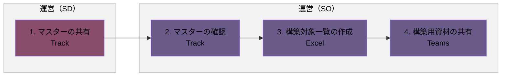
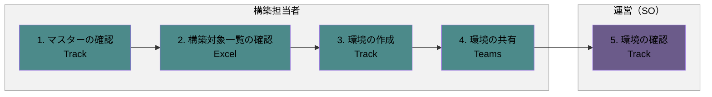
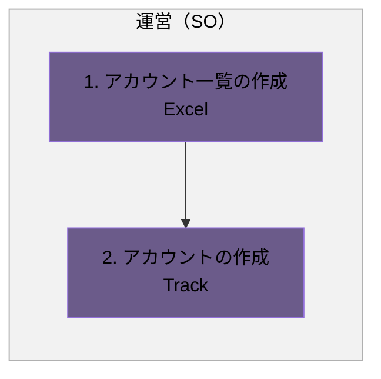

# Track構築フロー

## 概要

Track環境の構築用資材の準備から、クラス環境・アカウントの構築までの一連の業務フローです。

- 構築用資材の準備
- 環境の構築（クラス）
- 環境の構築（アカウント）

各業務は、発生タイミングや条件ごとに複数の図に分割し、担当者（レーン）ごとの流れを示しています。

### 実施タイミング

- 研修前

**凡例**

- レーン（枠）：運営（SO）（紫）／運営（SD）（ワイン）／構築担当者（テイール）
- 各業務は、発生タイミングや条件ごとに複数の図に分けています。各見出し直下の説明文が、その図が発生する条件です。
- 黄色い点線枠：元資料の注記（補足事項）

---

## 1. 構築用資材の準備

新年度・新規開催に向けて、Track構築用資材を準備する場合の流れです。

### フロー図

### 作業

1. マスターの共有
   - アクター
     - 運営（SD）
   - 概要
     - マスターを共有する
   - 利用ツール
     - Track
2. マスターの確認
   - アクター
     - 運営（SO）
   - 概要
     - マスターを確認する
   - 利用ツール
     - Track
3. 構築対象一覧の作成
   - アクター
     - 運営（SO）
   - 概要
     - 構築が必要なクラスを一覧にまとめる
   - 利用ツール
     - Excel
4. 構築用資材の共有
   - アクター
     - 運営（SO）
   - 概要
     - マスター、構築対象一覧を構築担当者に共有する
   - 利用ツール
     - Teams

---

## 2. 環境の構築（クラス）

構築用資材の共有後、構築担当者がクラス環境を構築し、運営（SO）が確認する場合の流れです。

### フロー図

### 作業

1. マスターの確認
   - アクター
     - 構築担当者
   - 概要
     - マスターの内容を確認する
   - 利用ツール
     - Track
2. 構築対象一覧の確認
   - アクター
     - 構築担当者
   - 概要
     - 構築が必要なクラスを確認する
   - 利用ツール
     - Excel
3. 環境の作成
   - アクター
     - 構築担当者
   - 概要
     - マスターを基に、クラスを作成する
   - 利用ツール
     - Track
4. 環境の共有
   - アクター
     - 構築担当者
   - 概要
     - 構築した環境を共有する
   - 利用ツール
     - Teams
5. 環境の確認
   - アクター
     - 運営（SO）
   - 概要
     - クラスが正しく作成されていることを確認する
   - 利用ツール
     - Track

---

## 3. 環境の構築（アカウント）

クラス環境の構築後、運営（SO）がアカウントを構築する場合の流れです。

### フロー図

### 作業

1. アカウント一覧の作成
   - アクター
     - 運営（SO）
   - 概要
     - 構築が必要なアカウントの一覧をまとめる
   - 利用ツール
     - Excel
2. アカウントの作成
   - アクター
     - 運営（SO）
   - 概要
     - アカウントを作成（クラスとの紐づけなど）する
   - 利用ツール
     - Track
