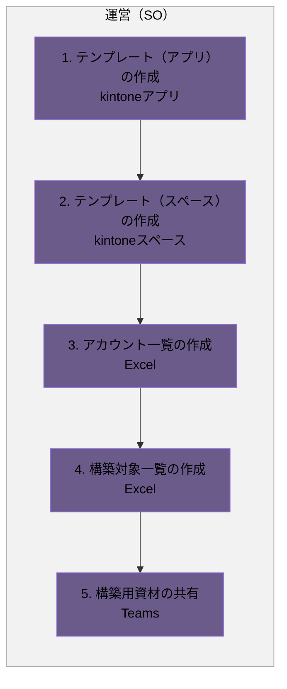
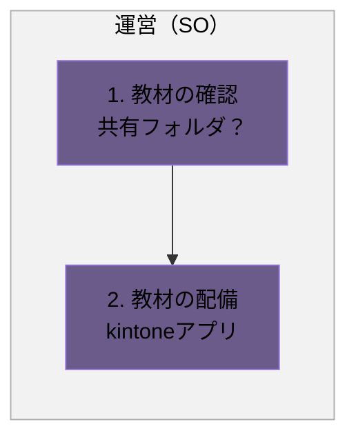

```mermaid
flowchart LR
    subgraph G1["構築担当者"]
        direction TB
        N1["1. アカウント一覧の確認<br/>Excel"]:::build
        N2["2. アカウントの作成<br/>kintone管理"]:::build
        N3["3. 構築対象一覧の確認<br/>Excel"]:::build
        N4["4. テンプレートの確認<br/>kintoneスペース・アプリ"]:::build
        N5["5. スペースの作成<br/>kintoneスペース"]:::build
        N6["6. アプリの作成<br/>kintoneアプリ"]:::build
        N7["7. 環境の共有<br/>Teams"]:::build
        N1 --> N2 --> N3 --> N4 --> N5 --> N6 --> N7
    end
    subgraph G2["運営（SO）"]
        direction TB
        N8["8. アカウントの確認<br/>kintone管理"]:::so
        N9["9. スペースの確認<br/>kintoneスペース"]:::so
        N10["10. アプリの確認<br/>kintoneアプリ"]:::so
        N8 --> N9 --> N10
    end

    N7 --> N8

    classDef build fill:#4c8a8a,color:#000;
    classDef so fill:#6b5b8a,color:#000;
    classDef note fill:#fff6cc,stroke:#c9a227,stroke-dasharray:4 3,color:#1c232c;
    classDef lane fill:#f2f2f2,stroke:#b0b0b0,color:#000;
    classDef invisible fill:none,stroke:none;

    class G1,G2 lane;
```

# kintone構築フロー

## 概要

kintone環境の構築用資材の準備から、環境構築、教材配備までの一連の業務フローです。

- 構築用資材の準備
- 環境の構築
- 教材の配備

各業務は、発生タイミングや条件ごとに複数の図に分割し、担当者（レーン）ごとの流れを示しています。

### 実施タイミング

- 研修前

**凡例**

- レーン（枠）：運営（SO）（紫）／構築担当者（テイール）
- 各業務は、発生タイミングや条件ごとに複数の図に分けています。各見出し直下の説明文が、その図が発生する条件です。
- 黄色い点線枠：元資料の注記（補足事項）

---

## 1. 構築用資材の準備

新年度・新規開催に向けて、運営（SO）が構築用資材を準備する場合の流れです。

### フロー図

### 作業

1. テンプレート（アプリ）の作成
   - アクター
     - 運営（SO）
   - 概要
     - 昨年度の資材を参考にアプリを改定する
   - 利用ツール
     - kintoneアプリ
2. テンプレート（スペース）の作成
   - アクター
     - 運営（SO）
   - 概要
     - 昨年度の資材を参考にスペースを改定する
   - 利用ツール
     - kintoneスペース
3. アカウント一覧の作成
   - アクター
     - 運営（SO）
   - 概要
     - 構築が必要なアカウントの一覧をまとめる
   - 利用ツール
     - Excel
4. 構築対象一覧の作成
   - アクター
     - 運営（SO）
   - 概要
     - 構築が必要なスペース・アプリを一覧にまとめる
   - 利用ツール
     - Excel
5. 構築用資材の共有
   - アクター
     - 運営（SO）
   - 概要
     - テンプレート、アカウント一覧および構築対象一覧を構築担当者に共有する
   - 利用ツール
     - Teams

---

## 2. 環境の構築

構築用資材の共有後、構築担当者が環境を構築し、運営（SO）が確認する場合の流れです。

### フロー図

### 作業

1. アカウント一覧の確認
   - アクター
     - 構築担当者
   - 概要
     - アカウントとして登録するユーザーを確認する
   - 利用ツール
     - Excel
2. アカウントの作成
   - アクター
     - 構築担当者
   - 概要
     - アカウントを作成する
   - 利用ツール
     - kintone管理
3. 構築対象一覧の確認
   - アクター
     - 構築担当者
   - 概要
     - 構築が必要なスペース・アプリを確認する
   - 利用ツール
     - Excel
4. テンプレートの確認
   - アクター
     - 構築担当者
   - 概要
     - テンプレートの内容を確認する
   - 利用ツール
     - kintoneスペース・アプリ
5. スペースの作成
   - アクター
     - 構築担当者
   - 概要
     - テンプレートを基に、スペースを作成する
   - 利用ツール
     - kintoneスペース
6. アプリの作成
   - アクター
     - 構築担当者
   - 概要
     - テンプレートを基に、アプリを作成する
   - 利用ツール
     - kintoneアプリ
7. 環境の共有
   - アクター
     - 構築担当者
   - 概要
     - 構築した環境を共有する
   - 利用ツール
     - Teams
8. アカウントの確認
   - アクター
     - 運営（SO）
   - 概要
     - アカウントが正しく作成されていることを確認する
   - 利用ツール
     - kintone管理
9. スペースの確認
   - アクター
     - 運営（SO）
   - 概要
     - スペースが正しく作成されていることを確認する
   - 利用ツール
     - kintoneスペース
10. アプリの確認
    - アクター
      - 運営（SO）
    - 概要
      - アプリが正しく作成されていることを確認する
    - 利用ツール
      - kintoneアプリ

---

## 3. 教材の配備

環境構築後、運営（SO）が教材をkintone環境に配備する場合の流れです。

### フロー図

### 作業

1. 教材の確認
   - アクター
     - 運営（SO）
   - 概要
     - 教材を確認する
   - 利用ツール
     - 共有フォルダ？
2. 教材の配備
   - アクター
     - 運営（SO）
   - 概要
     - 教材を配備する
   - 利用ツール
     - kintoneアプリ
