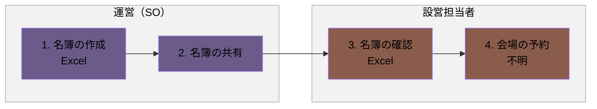
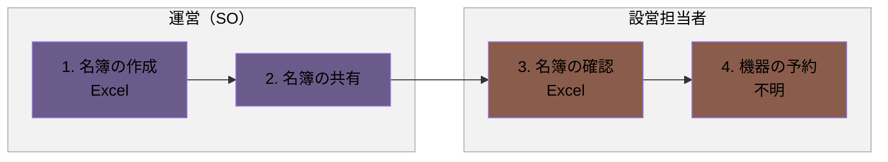

# 会場予約フロー

## 概要

会場・機器の予約に向けた名簿の準備から、予約までの一連の業務フローです。

- 会場の予約
- 機器の予約

各業務は、発生タイミングや条件ごとに複数の図に分割し、担当者（レーン）ごとの流れを示しています。

### 実施タイミング

- 研修前

**凡例**

- レーン（枠）：運営（SO）（紫）／設営担当者（テラコッタ）
- 各業務は、発生タイミングや条件ごとに複数の図に分けています。各見出し直下の説明文が、その図が発生する条件です。
- 黄色い点線枠：元資料の注記（補足事項）

---

## 1. 会場の予約

研修開催に向けて、会場を予約する場合の流れです。

### フロー図

### 作業

1. 名簿の作成
   - アクター
     - 運営（SO）
   - 概要
     - 名簿（会場数など）を作成する
   - 利用ツール
     - Excel
2. 名簿の共有
   - アクター
     - 運営（SO）
   - 概要
     - 名簿を設営担当者に共有する
3. 名簿の確認
   - アクター
     - 設営担当者
   - 概要
     - 名簿の内容を確認する
   - 利用ツール
     - Excel
4. 会場の予約
   - アクター
     - 設営担当者
   - 概要
     - 会場を予約する
   - 利用ツール
     - 不明

---

## 2. 機器の予約

研修開催に向けて、機器を予約する場合の流れです。

### フロー図

### 作業

1. 名簿の作成
   - アクター
     - 運営（SO）
   - 概要
     - 名簿（PC数など）を作成する
   - 利用ツール
     - Excel
2. 名簿の共有
   - アクター
     - 運営（SO）
   - 概要
     - 名簿を設営担当者に共有する
3. 名簿の確認
   - アクター
     - 設営担当者
   - 概要
     - 名簿の内容を確認する
   - 利用ツール
     - Excel
4. 機器の予約
   - アクター
     - 設営担当者
   - 概要
     - 機器を予約する
   - 利用ツール
     - 不明
