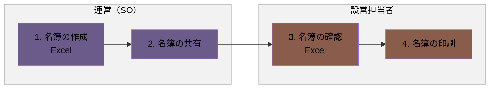
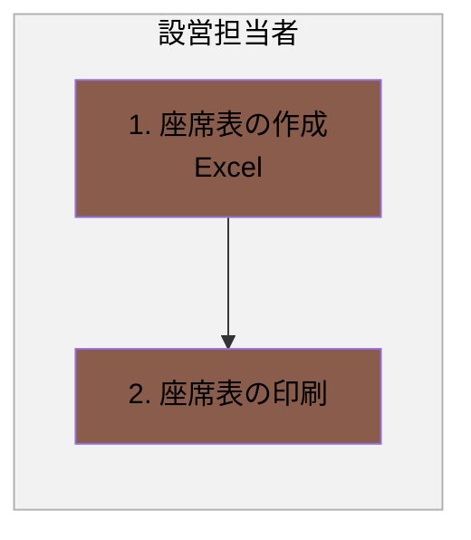
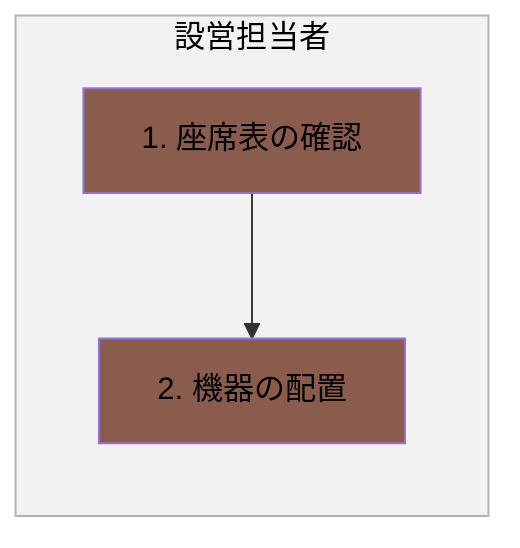
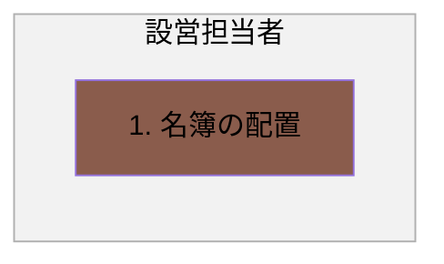
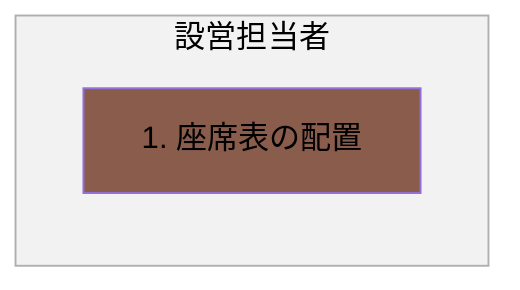

# 会場設営フロー

## 概要

会場設営に向けた名簿・座席表の準備から、機器の配置、当日の配置までの一連の業務フローです。

- 名簿の準備
- 座席表の準備
- 機器の配置
- 名簿の配置
- 座席表の配置

各業務は、発生タイミングや条件ごとに複数の図に分割し、担当者（レーン）ごとの流れを示しています。

### 実施タイミング

- 研修前

**凡例**

- レーン（枠）：運営（SO）（紫）／設営担当者（テラコッタ）
- 各業務は、発生タイミングや条件ごとに複数の図に分けています。各見出し直下の説明文が、その図が発生する条件です。
- 黄色い点線枠：元資料の注記（補足事項）

---

## 1. 名簿の準備

研修開催に向けて、名簿を準備し設営担当者に共有する場合の流れです。

### フロー図

### 作業

1. 名簿の作成
   - アクター
     - 運営（SO）
   - 概要
     - 名簿（会社名・氏名・クラス名）を作成する
   - 利用ツール
     - Excel
2. 名簿の共有
   - アクター
     - 運営（SO）
   - 概要
     - 名簿を設営担当者に共有する
3. 名簿の確認
   - アクター
     - 設営担当者
   - 概要
     - 名簿の内容を確認する
   - 利用ツール
     - Excel
4. 名簿の印刷
   - アクター
     - 設営担当者
   - 概要
     - 名簿を印刷する

---

## 2. 座席表の準備

名簿を基に、設営担当者が座席表を準備する場合の流れです。

### フロー図

### 作業

1. 座席表の作成
   - アクター
     - 設営担当者
   - 概要
     - 名簿を基に座席表を作成する
   - 利用ツール
     - Excel
2. 座席表の印刷
   - アクター
     - 設営担当者
   - 概要
     - 座席表を印刷する

---

## 3. 機器の配置

座席表を基に、設営担当者が機器を配置する場合の流れです。

### フロー図

### 作業

1. 座席表の確認
   - アクター
     - 設営担当者
   - 概要
     - 座席表を確認する
2. 機器の配置
   - アクター
     - 設営担当者
   - 概要
     - 座席表を基に、機器を配置する

---

## 4. 名簿の配置

会場に名簿を配置する場合の流れです。

### フロー図

### 作業

1. 名簿の配置
   - アクター
     - 設営担当者
   - 概要
     - 名簿を配置する

---

## 5. 座席表の配置

会場に座席表を配置する場合の流れです。

### フロー図

### 作業

1. 座席表の配置
   - アクター
     - 設営担当者
   - 概要
     - 座席表を配置する
