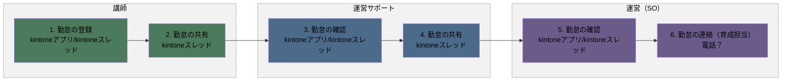
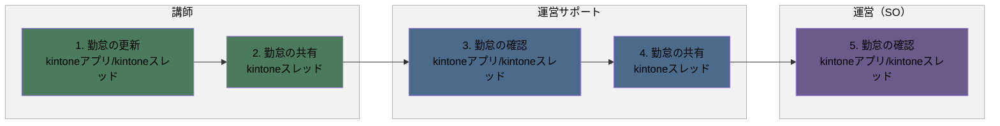

```mermaid
flowchart LR
    subgraph G1["受講生"]
        direction TB
        N1["1. 勤怠の連絡（育成担当）<br/>電話"]:::student
        subgraph G1_g1[" "]
            direction LR
            N2["2. 勤怠の連絡（運用サポート）<br/>電話"]:::student
            N2 -.- M0["複数の受講生に対応するため、勤怠の登録アプリなど別の方法が良いかもしれない"]:::note
        end
        N1 --> G1_g1
    end
    subgraph G2["運営サポート"]
        direction TB
        subgraph G2_g1[" "]
            direction LR
            N3["3. 勤怠の登録<br/>kintoneアプリ/kintoneスレッド"]:::ops
            N3 -.- M1["育成担当も閲覧できるため、理由に応じてkintoneアプリ/kintoneスレッドを使い分ける<br/>使い分けにローカルルールが存在している"]:::note
        end
        N4["4. 勤怠の共有<br/>朝会時の連絡"]:::ops
        G2_g1 --> N4
    end
    subgraph G3["運営（SO）"]
        direction TB
        N5["5. 勤怠の確認<br/>kintoneアプリ/kintoneスレッド"]:::so
        N6["6. 勤怠の共有<br/>kintoneスレッド"]:::so
        N5 --> N6
    end
    subgraph G4["講師"]
        direction TB
        N7["7. 勤怠の確認<br/>kintoneアプリ/kintoneスレッド"]:::instr
    end

    G1_g1 --> G2_g1
    N4 --> N5
    N6 --> N7

    classDef ops fill:#4c6b8a,color:#000;
    classDef so fill:#6b5b8a,color:#000;
    classDef instr fill:#4c7a5d,color:#000;
    classDef student fill:#a9822f,color:#000;
    classDef note fill:#fff6cc,stroke:#c9a227,stroke-dasharray:4 3,color:#1c232c;
    classDef lane fill:#f2f2f2,stroke:#b0b0b0,color:#000;
    classDef invisible fill:none,stroke:none;

    class G1,G2,G3,G4 lane;
    class G1_g1,G2_g1 invisible;
```

# 勤怠フロー

## 概要

勤怠の登録から確認・共有までの一連の業務フローです。

- 勤怠の登録（事前連絡あり）
- 勤怠の登録（事前連絡なし）
- 勤怠の更新（到着後）

各業務は、発生タイミングや条件ごとに複数の図に分割し、担当者（レーン）ごとの流れを示しています。

### 実施タイミング

- 研修当日

**凡例**

- レーン（枠）：運営サポート（青）／運営（SO）（紫）／講師（緑）／受講生（黄土）
- 各業務は、発生タイミングや条件（事前連絡の有無・到着後など）ごとに複数の図に分けています。各見出し直下の説明文が、その図が発生する条件です。
- 黄色い点線枠：元資料の注記（補足事項）

---

## 1. 勤怠の登録（事前連絡あり）

受講生から事前に欠席・遅刻等の連絡があった場合の勤怠登録の流れです。

### フロー図

### 作業

1. 勤怠の連絡（育成担当）
   - アクター
     - 受講生
   - 概要
     - 勤怠を育成担当に連絡する
   - 利用ツール
     - 電話
2. 勤怠の連絡（運用サポート）
   - アクター
     - 受講生
   - 概要
     - 勤怠を運用サポートに連絡する
   - 利用ツール
     - 電話
   - メモ
     - 複数の受講生に対応するため、勤怠の登録アプリなど別の方法が良いかもしれない
3. 勤怠の登録
   - アクター
     - 運営サポート
   - 概要
     - 勤怠を入力する
   - 利用ツール
     - kintoneアプリ/kintoneスレッド
   - メモ
     - 育成担当も閲覧できるため、理由に応じてkintoneアプリ/kintoneスレッドを使い分ける
     - 使い分けにローカルルールが存在している
4. 勤怠の共有
   - アクター
     - 運営サポート
   - 概要
     - 勤怠を共有する
   - 利用ツール
     - 朝会時の連絡
5. 勤怠の確認
   - アクター
     - 運営（SO）
   - 概要
     - 勤怠を確認する
   - 利用ツール
     - kintoneアプリ/kintoneスレッド
6. 勤怠の共有
   - アクター
     - 運営（SO）
   - 概要
     - 勤怠を共有する
   - 利用ツール
     - kintoneスレッド
7. 勤怠の確認
   - アクター
     - 講師
   - 概要
     - 勤怠を確認する
   - 利用ツール
     - kintoneアプリ/kintoneスレッド

---

## 2. 勤怠の登録（事前連絡なし）

受講生から事前連絡がなく、講師が勤怠を確認して登録する場合の流れです。

### フロー図

### 作業

1. 勤怠の登録
   - アクター
     - 講師
   - 概要
     - 勤怠を入力する
   - 利用ツール
     - kintoneアプリ/kintoneスレッド
2. 勤怠の共有
   - アクター
     - 講師
   - 概要
     - 勤怠を共有する
   - 利用ツール
     - kintoneスレッド
3. 勤怠の確認
   - アクター
     - 運営サポート
   - 概要
     - 勤怠を確認する
   - 利用ツール
     - kintoneアプリ/kintoneスレッド
4. 勤怠の共有
   - アクター
     - 運営サポート
   - 概要
     - 勤怠を共有する
   - 利用ツール
     - kintoneスレッド
5. 勤怠の確認
   - アクター
     - 運営（SO）
   - 概要
     - 勤怠を確認する
   - 利用ツール
     - kintoneアプリ/kintoneスレッド
6. 勤怠の連絡（育成担当）
   - アクター
     - 運営（SO）
   - 概要
     - 勤怠を育成担当に連絡する
   - 利用ツール
     - 電話？

---

## 3. 勤怠の更新（到着後）

受講生の到着後、勤怠情報を更新する場合の流れです。

### フロー図

### 作業

1. 勤怠の更新
   - アクター
     - 講師
   - 概要
     - 勤怠を更新する
   - 利用ツール
     - kintoneアプリ/kintoneスレッド
2. 勤怠の共有
   - アクター
     - 講師
   - 概要
     - 勤怠を共有する
   - 利用ツール
     - kintoneスレッド
3. 勤怠の確認
   - アクター
     - 運営サポート
   - 概要
     - 勤怠を確認する
   - 利用ツール
     - kintoneアプリ/kintoneスレッド
4. 勤怠の共有
   - アクター
     - 運営サポート
   - 概要
     - 勤怠を共有する
   - 利用ツール
     - kintoneスレッド
5. 勤怠の確認
   - アクター
     - 運営（SO）
   - 概要
     - 勤怠を確認する
   - 利用ツール
     - kintoneアプリ/kintoneスレッド
