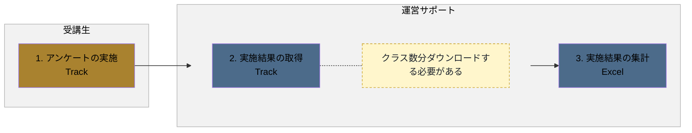
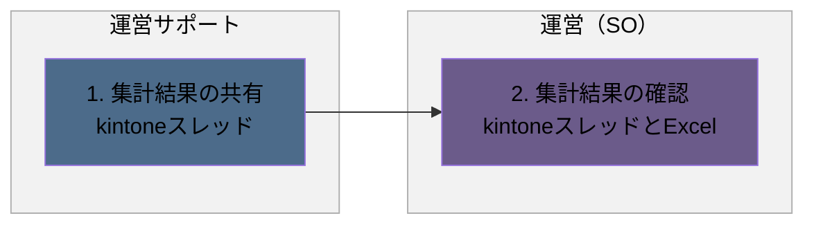
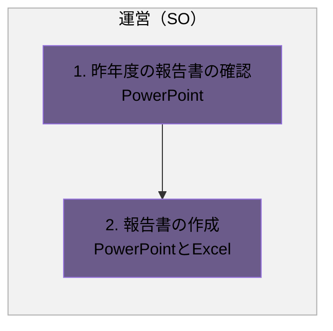

```mermaid
flowchart LR
    subgraph G1["運営サポート"]
        direction TB
        N1["1. 未実施者の特定<br/>Excel"]:::ops
        N2["2. 未実施者の共有<br/>kintoneスレッドと朝会時の共有"]:::ops
        N1 --> N2
    end
    subgraph G2["講師"]
        direction TB
        N3["3. 未実施者の確認<br/>kintoneスレッド"]:::instr
        N4["4. 実施の督促<br/>kintoneスレッドや夕礼時の共有"]:::instr
        N3 --> N4
    end
    subgraph G3["受講生"]
        direction TB
        N5["5. アンケートの実施<br/>Track"]:::student
    end
    subgraph G4["運営サポート"]
        direction TB
        N6["6. 実施結果の取得<br/>Track"]:::ops
        N7["7. 実施結果の集計<br/>Excel"]:::ops
        N6 --> N7
    end

    N2 --> N3
    N4 --> N5
    N5 --> N6

    classDef ops fill:#4c6b8a,color:#000;
    classDef instr fill:#4c7a5d,color:#000;
    classDef student fill:#a9822f,color:#000;
    classDef note fill:#fff6cc,stroke:#c9a227,stroke-dasharray:4 3,color:#1c232c;
    classDef lane fill:#f2f2f2,stroke:#b0b0b0,color:#000;
    classDef invisible fill:none,stroke:none;

    class G1,G2,G3,G4 lane;
```

# アンケートフロー

## 概要

アンケート実施から報告書作成までの一連の業務フローです。

- 実施と集計
- 未実施者への対応
- 集計結果の共有
- 報告書の作成

各業務は、発生タイミングや条件ごとに複数の図に分割し、担当者（レーン）ごとの流れを示しています。

### 実施タイミング

- 研修後

**凡例**

- レーン（枠）：運営サポート（青）／運営（SO）（紫）／講師（緑）／受講生（黄土）
- 各業務は、発生タイミングや条件（未実施者の有無など）ごとに複数の図に分けています。各見出し直下の説明文が、その図が発生する条件です。
- 黄色い点線枠：元資料の注記（補足事項）

---

## 1. 実施と集計

研修終了後、受講生がアンケートを実施し、運営サポートが結果を取得・集計する場合の流れです。

### フロー図

### 作業

1. アンケートの実施
   - アクター
     - 受講生
   - 概要
     - アンケートを実施する
   - 利用ツール
     - Track
2. 実施結果の取得
   - アクター
     - 運営サポート
   - 概要
     - アンケートの結果をダウンロードする
   - 利用ツール
     - Track
   - メモ
     - クラス数分ダウンロードする必要がある
3. 実施結果の集計
   - アクター
     - 運営サポート
   - 概要
     - 実施結果を基に、アンケートの結果を集計する
   - 利用ツール
     - Excel

---

## 2. 未実施者への対応

集計時点でアンケート未実施の受講生がいた場合の対応です。

### フロー図

### 作業

1. 未実施者の特定
   - アクター
     - 運営サポート
   - 概要
     - 集計結果を基に、未実施者を特定する
   - 利用ツール
     - Excel
2. 未実施者の共有
   - アクター
     - 運営サポート
   - 概要
     - 未実施者を共有する
   - 利用ツール
     - kintoneスレッドと朝会時の共有
3. 未実施者の確認
   - アクター
     - 講師
   - 概要
     - 担当する未実施者を確認する
   - 利用ツール
     - kintoneスレッド
4. 実施の督促
   - アクター
     - 講師
   - 概要
     - 未実施者に実施を督促する
   - 利用ツール
     - kintoneスレッドや夕礼時の共有
5. アンケートの実施
   - アクター
     - 受講生
   - 概要
     - アンケートを実施する
   - 利用ツール
     - Track
6. 実施結果の取得
   - アクター
     - 運営サポート
   - 概要
     - アンケートの結果をダウンロードする
   - 利用ツール
     - Track
7. 実施結果の集計
   - アクター
     - 運営サポート
   - 概要
     - 実施結果を基に、アンケートの結果を集計する
   - 利用ツール
     - Excel

---

## 3. 集計結果の共有

アンケートの集計が完了し、結果を共有する場合の流れです。

### フロー図

### 作業

1. 集計結果の共有
   - アクター
     - 運営サポート
   - 概要
     - 集計結果を共有する
   - 利用ツール
     - kintoneスレッド
2. 集計結果の確認
   - アクター
     - 運営（SO）
   - 概要
     - 集計結果を確認する
   - 利用ツール
     - kintoneスレッドとExcel

---

## 4. 報告書の作成

集計結果の共有後、運営（SO）が報告書を作成する場合の流れです。

### フロー図

### 作業

1. 昨年度の報告書の確認
   - アクター
     - 運営（SO）
   - 概要
     - 昨年度の報告書を確認する
   - 利用ツール
     - PowerPoint
2. 報告書の作成
   - アクター
     - 運営（SO）
   - 概要
     - 昨年度の報告書と集計結果を基に、今年度用の報告書を作成する
   - 利用ツール
     - PowerPointとExcel
