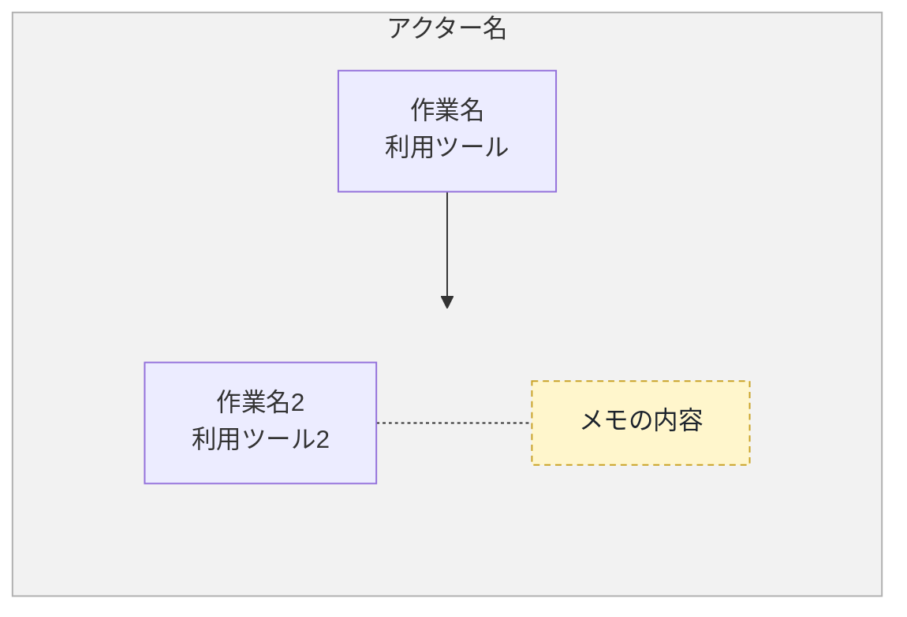

# ファイル名

## 概要

XXX

- フロー名1
- フロー名2

各業務は、発生タイミングや条件ごとに複数の図に分割し、担当者（レーン）ごとの流れを示しています。

**凡例**

- レーン（枠）：運営サポート（青）／運営（SO）（紫）／講師（緑）／受講生（黄土）
- 各業務は、発生タイミングや条件（到着前後・未実施時・アラート時など）ごとに複数の図に分けています。各見出し直下の説明文が、その図が発生する条件です。
- 黄色い点線枠：元資料の注記（補足事項）

---

## 1. フロー名１

フロー名１の概要

### フロー図

### 作業

1. 作業名1
   - アクター
     - 作業名1のアクター
   - 概要
     - 作業名1の概要
   - 利用ツール
     - 作業名1の利用ツール
2. 作業名2
   - アクター
     - 作業名2のアクター
　 - 概要
     - 作業名2の概要
   - 利用ツール
     - 作業名2の利用ツール
