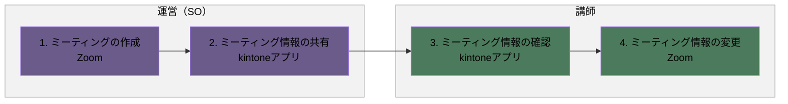
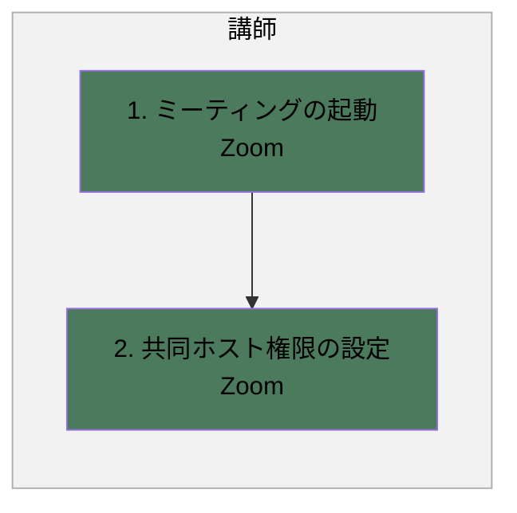
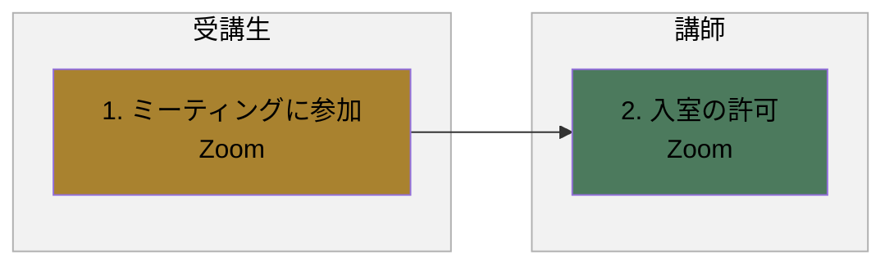
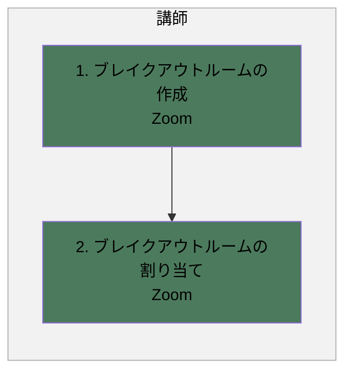

# Zoom利用フロー

## 概要

Zoomミーティングの作成から、起動・参加、ブレイクアウトルーム作成までの一連の業務フローです。

- ミーティングの作成
- ミーティングの起動と権限の設定
- ミーティングへの参加
- ブレイクアウトルームの作成

各業務は、発生タイミングや条件ごとに複数の図に分割し、担当者（レーン）ごとの流れを示しています。

**凡例**

- レーン（枠）：運営（SO）（紫）／講師（緑）／受講生（黄土）
- 各業務は、発生タイミングや条件（研修開催前・当日など）ごとに複数の図に分けています。各見出し直下の説明文が、その図が発生する条件です。
- 黄色い点線枠：元資料の注記（補足事項）

---

## 1. ミーティングの作成

研修開催前に、運営（SO）がミーティングを作成し講師と共有する場合の流れです。

### フロー図

### 作業

1. ミーティングの作成
   - アクター
     - 運営（SO）
   - 概要
     - ミーティングを作成する
   - 利用ツール
     - Zoom
2. ミーティング情報の共有
   - アクター
     - 運営（SO）
   - 概要
     - ミーティング情報を共有する
   - 利用ツール
     - kintoneアプリ
3. ミーティング情報の確認
   - アクター
     - 講師
   - 概要
     - ミーティング情報を確認する
   - 利用ツール
     - kintoneアプリ
4. ミーティング情報の変更
   - アクター
     - 講師
   - 概要
     - ミーティングのアンケートや表示機能を変更する
   - 利用ツール
     - Zoom

---

## 2. ミーティングの起動と権限の設定

研修当日、講師がミーティングを起動し権限を設定する場合の流れです。

### フロー図

### 作業

1. ミーティングの起動
   - アクター
     - 講師
   - 概要
     - ミーティング情報を基にミーティングを開始する
   - 利用ツール
     - Zoom
2. 共同ホスト権限の設定
   - アクター
     - 講師
   - 概要
     - 共同ホスト権限を設定する
   - 利用ツール
     - Zoom

---

## 3. ミーティングへの参加

受講生がミーティングに参加する場合の流れです。

### フロー図

### 作業

1. ミーティングに参加
   - アクター
     - 受講生
   - 概要
     - ミーティングに参加する
   - 利用ツール
     - Zoom
2. 入室の許可
   - アクター
     - 講師
   - 概要
     - 待機中の受講生の入室を許可する
   - 利用ツール
     - Zoom

---

## 4. ブレイクアウトルームの作成

講師がブレイクアウトルームを作成し受講生を割り当てる場合の流れです。

### フロー図

### 作業

1. ブレイクアウトルームの作成
   - アクター
     - 講師
   - 概要
     - ブレイクアウトルームを作成する
   - 利用ツール
     - Zoom
2. ブレイクアウトルームの割り当て
   - アクター
     - 講師
   - 概要
     - ブレイクアウトルームに受講生を割り当てる
   - 利用ツール
     - Zoom
