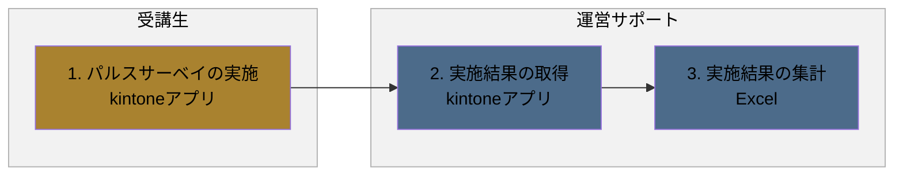
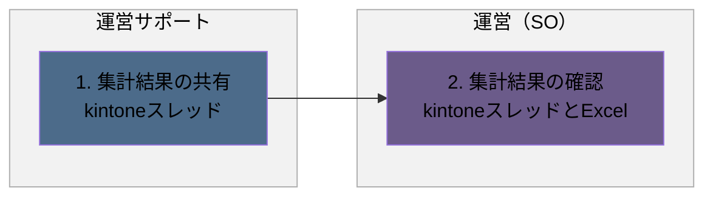
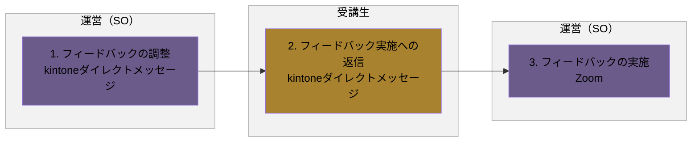

# パルスサーベイフロー

## 概要

パルスサーベイの実施・集計から、結果の共有、フィードバックまでの一連の業務フローです。

- 実施と集計
- 集計結果の共有
- 集計結果のフィードバック

各業務は、発生タイミングや条件ごとに複数の図に分割し、担当者（レーン）ごとの流れを示しています。

**凡例**

- レーン（枠）：運営サポート（青）／運営（SO）（紫）／受講生（黄土）
- 各業務は、発生タイミングや条件ごとに複数の図に分けています。各見出し直下の説明文が、その図が発生する条件です。
- 黄色い点線枠：元資料の注記（補足事項）

---

## 1. 実施と集計

研修中、受講生がパルスサーベイを実施し、運営サポートが結果を取得・集計する場合の流れです。

### フロー図

### 作業

1. パルスサーベイの実施
   - アクター
     - 受講生
   - 概要
     - パルスサーベイを実施する
   - 利用ツール
     - kintoneアプリ
2. 実施結果の取得
   - アクター
     - 運営サポート
   - 概要
     - パルスサーベイの結果をダウンロードする
   - 利用ツール
     - kintoneアプリ
3. 実施結果の集計
   - アクター
     - 運営サポート
   - 概要
     - 実施結果を基に、パルスサーベイの結果を集計する
   - 利用ツール
     - Excel

---

## 2. 集計結果の共有

パルスサーベイの集計が完了し、結果を共有する場合の流れです。

### フロー図

### 作業

1. 集計結果の共有
   - アクター
     - 運営サポート
   - 概要
     - 集計結果を共有する
   - 利用ツール
     - kintoneスレッド
2. 集計結果の確認
   - アクター
     - 運営（SO）
   - 概要
     - 集計結果を確認する
   - 利用ツール
     - kintoneスレッドとExcel

---

## 3. 集計結果のフィードバック

集計結果を基に、運営（SO）が受講生へフィードバックを実施する場合の流れです。

### フロー図

### 作業

1. フィードバックの調整
   - アクター
     - 運営（SO）
   - 概要
     - フィードバックの実施時刻を調整する
   - 利用ツール
     - kintoneダイレクトメッセージ
2. フィードバック実施への返信
   - アクター
     - 受講生
   - 概要
     - フィードバックが可能かどうか返信する
   - 利用ツール
     - kintoneダイレクトメッセージ
3. フィードバックの実施
   - アクター
     - 運営（SO）
   - 概要
     - フィードバックを実施する
   - 利用ツール
     - Zoom
