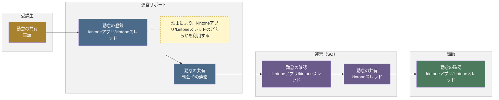
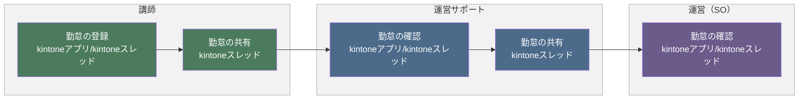

# 勤怠フロー

## 概要

受講生・講師の勤怠について、事前連絡の有無や到着後の更新といった状況ごとに、登録から運営サポート・運営（SO）・講師への共有・確認までの流れを示します。

- 勤怠の登録（事前連絡あり）
- 勤怠の登録（事前連絡なし）
- 勤怠の更新（到着後）

各業務は、発生タイミングや条件ごとに複数の図に分割し、担当者（レーン）ごとの流れを示しています。

**凡例**

- レーン（枠）：運営サポート（青）／運営（SO）（紫）／講師（緑）／受講生（黄土）
- 各業務は、発生タイミングや条件（事前連絡あり・事前連絡なし・到着後など）ごとに複数の図に分けています。各見出し直下の説明文が、その図が発生する条件です。
- 黄色い点線枠：元資料の注記（補足事項）

---

## 1. 勤怠の登録（事前連絡あり）

受講生から事前に勤怠の連絡があった場合の流れです。

### フロー図

### 作業

1. 勤怠の共有
   - アクター
     - 受講生
   - 概要
     - 勤怠を共有する
   - 利用ツール
     - 電話
2. 勤怠の登録
   - アクター
     - 運営サポート
   - 概要
     - 勤怠を入力する
   - 利用ツール
     - kintoneアプリ/kintoneスレッド
   - メモ
     - 理由により、kintoneアプリ/kintoneスレッドのどちらかを利用する
3. 勤怠の共有
   - アクター
     - 運営サポート
   - 概要
     - 勤怠を共有する
   - 利用ツール
     - 朝会時の連絡
4. 勤怠の確認
   - アクター
     - 運営（SO）
   - 概要
     - 勤怠を確認する
   - 利用ツール
     - kintoneアプリ/kintoneスレッド
5. 勤怠の共有
   - アクター
     - 運営（SO）
   - 概要
     - 勤怠を共有する
   - 利用ツール
     - kintoneスレッド
6. 勤怠の確認
   - アクター
     - 講師
   - 概要
     - 勤怠を確認する
   - 利用ツール
     - kintoneアプリ/kintoneスレッド

---

## 2. 勤怠の登録（事前連絡なし）

受講生から事前の勤怠連絡がなく、講師が代わりに勤怠を登録する場合の流れです。

### フロー図

### 作業

1. 勤怠の登録
   - アクター
     - 講師
   - 概要
     - 勤怠を入力する
   - 利用ツール
     - kintoneアプリ/kintoneスレッド
2. 勤怠の共有
   - アクター
     - 講師
   - 概要
     - 勤怠を共有する
   - 利用ツール
     - kintoneスレッド
3. 勤怠の確認
   - アクター
     - 運営サポート
   - 概要
     - 勤怠を確認する
   - 利用ツール
     - kintoneアプリ/kintoneスレッド
4. 勤怠の共有
   - アクター
     - 運営サポート
   - 概要
     - 勤怠を共有する
   - 利用ツール
     - kintoneスレッド
5. 勤怠の確認
   - アクター
     - 運営（SO）
   - 概要
     - 勤怠を確認する
   - 利用ツール
     - kintoneアプリ/kintoneスレッド

---

## 3. 勤怠の更新（到着後）

到着後に講師が勤怠を更新する場合の流れです。

### フロー図

### 作業

1. 勤怠の更新
   - アクター
     - 講師
   - 概要
     - 勤怠を入力する
   - 利用ツール
     - kintoneアプリ/kintoneスレッド
2. 勤怠の共有
   - アクター
     - 講師
   - 概要
     - 勤怠を共有する
   - 利用ツール
     - kintoneスレッド
3. 勤怠の確認
   - アクター
     - 運営サポート
   - 概要
     - 勤怠を確認する
   - 利用ツール
     - kintoneアプリ/kintoneスレッド
4. 勤怠の共有
   - アクター
     - 運営サポート
   - 概要
     - 勤怠を共有する
   - 利用ツール
     - kintoneスレッド
5. 勤怠の確認
   - アクター
     - 運営（SO）
   - 概要
     - 勤怠を確認する
   - 利用ツール
     - kintoneアプリ/kintoneスレッド
