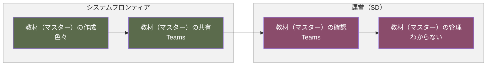
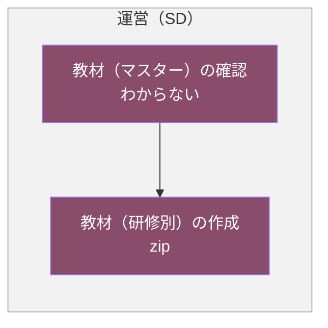
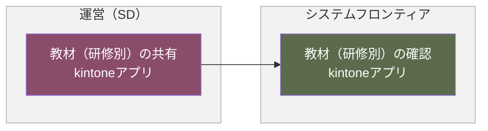
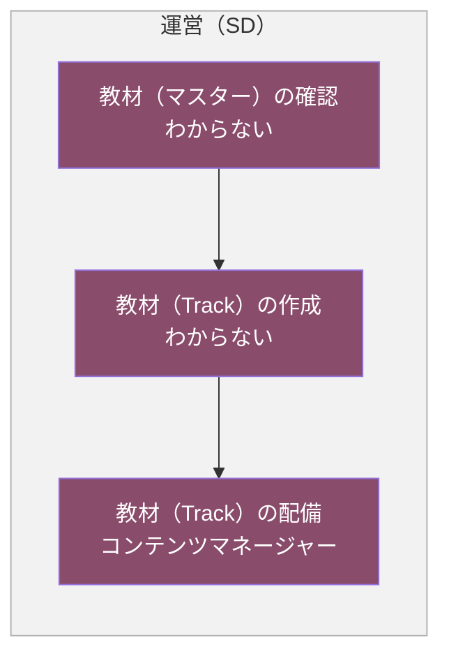
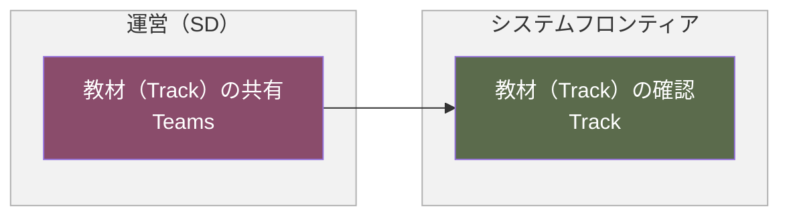

# 教材作成フロー

## 概要

教材の作成から共有・確認までについて、教材の種類（マスター・研修別・Track）ごとに、システムフロンティアと運営（SD）の間での作成・確認・配備の流れを示します。

- 教材（マスター）の作成
- 教材（研修別）の作成
- 教材（研修別）の確認
- 教材（Track）の作成
- 教材（Track）の確認

各業務は、発生タイミングや条件ごとに複数の図に分割し、担当者（レーン）ごとの流れを示しています。

**凡例**

- レーン（枠）：運営（SD）（ワイン）／システムフロンティア（オリーブ）
- 各業務は、発生タイミングや条件（マスター作成・研修別作成・研修別確認・Track作成・Track確認など）ごとに複数の図に分けています。各見出し直下の説明文が、その図が発生する条件です。
- 黄色い点線枠：元資料の注記（補足事項）

---

## 1. 教材（マスター）の作成

教材のマスターを作成し、運営（SD）が確認・管理する場合の流れです。

### フロー図

### 作業

1. 教材（マスター）の作成
   - アクター
     - システムフロンティア
   - 概要
     - 教材（マスター）を作成する
   - 利用ツール
     - 色々
2. 教材（マスター）の共有
   - アクター
     - システムフロンティア
   - 概要
     - 教材（マスター）を共有する
   - 利用ツール
     - Teams
3. 教材（マスター）の確認
   - アクター
     - 運営（SD）
   - 概要
     - 教材（マスター）を確認する
   - 利用ツール
     - Teams
4. 教材（マスター）の管理
   - アクター
     - 運営（SD）
   - 概要
     - 教材（マスター）を共有フォルダにアップロードする
   - 利用ツール
     - わからない

---

## 2. 教材（研修別）の作成

運営（SD）がマスターを基に研修別の教材を作成する場合の流れです。

### フロー図

### 作業

1. 教材（マスター）の確認
   - アクター
     - 運営（SD）
   - 概要
     - 教材（マスター）を確認する
   - 利用ツール
     - わからない
2. 教材（研修別）の作成
   - アクター
     - 運営（SD）
   - 概要
     - 教材（研修別）を作成する
   - 利用ツール
     - zip

---

## 3. 教材（研修別）の確認

作成した研修別の教材を運営（SD）が共有し、システムフロンティアが確認する場合の流れです。

### フロー図

### 作業

1. 教材（研修別）の共有
   - アクター
     - 運営（SD）
   - 概要
     - 教材（研修別）を共有する
   - 利用ツール
     - kintoneアプリ
2. 教材（研修別）の確認
   - アクター
     - システムフロンティア
   - 概要
     - 教材（研修別）を確認する
   - 利用ツール
     - kintoneアプリ

---

## 4. 教材（Track）の作成

運営（SD）がマスターを基にTrack用の教材を作成し、配備する場合の流れです。

### フロー図

### 作業

1. 教材（マスター）の確認
   - アクター
     - 運営（SD）
   - 概要
     - 教材（マスター）を確認する
   - 利用ツール
     - わからない
2. 教材（Track）の作成
   - アクター
     - 運営（SD）
   - 概要
     - 教材（Track）を作成する
   - 利用ツール
     - わからない
3. 教材（Track）の配備
   - アクター
     - 運営（SD）
   - 概要
     - 教材（Track）を配備する
   - 利用ツール
     - コンテンツマネージャー

---

## 5. 教材（Track）の確認

配備したTrack用の教材を運営（SD）が共有し、システムフロンティアが確認する場合の流れです。

### フロー図

### 作業

1. 教材（Track）の共有
   - アクター
     - 運営（SD）
   - 概要
     - 教材（Track）を共有する
   - 利用ツール
     - Teams
2. 教材（Track）の確認
   - アクター
     - システムフロンティア
   - 概要
     - 教材（Track）を確認する
   - 利用ツール
     - Track
