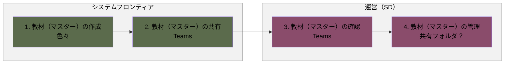
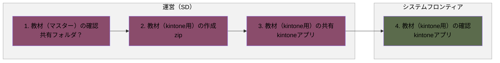
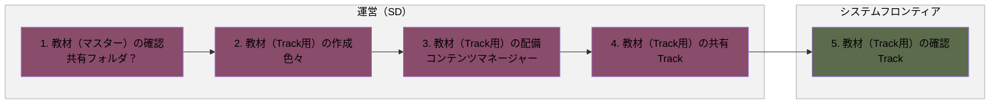

# 教材準備フロー

## 概要

教材（マスター）の作成から、kintone用・Track用教材の作成までの一連の業務フローです。

- 教材（マスター）の作成
- 教材（kintone用）の作成
- 教材（Track用）の作成

各業務は、発生タイミングや条件ごとに複数の図に分割し、担当者（レーン）ごとの流れを示しています。

**凡例**

- レーン（枠）：運営（SD）（ワイン）／システムフロンティア（オリーブ）
- 各業務は、発生タイミングや条件ごとに複数の図に分けています。各見出し直下の説明文が、その図が発生する条件です。
- 黄色い点線枠：元資料の注記（補足事項）

---

## 1. 教材（マスター）の作成

新年度・新規開催に向けて、システムフロンティアが教材マスターを作成し、運営（SD）が確認・管理する場合の流れです。

### フロー図

### 作業

1. 教材（マスター）の作成
   - アクター
     - システムフロンティア
   - 概要
     - 教材（マスター）を作成する
   - 利用ツール
     - 色々
2. 教材（マスター）の共有
   - アクター
     - システムフロンティア
   - 概要
     - 教材（マスター）を共有する
   - 利用ツール
     - Teams
3. 教材（マスター）の確認
   - アクター
     - 運営（SD）
   - 概要
     - 教材（マスター）を確認する
   - 利用ツール
     - Teams
4. 教材（マスター）の管理
   - アクター
     - 運営（SD）
   - 概要
     - 教材（マスター）を管理する
   - 利用ツール
     - 共有フォルダ？

---

## 2. 教材（kintone用）の作成

教材マスター確認後、運営（SD）がkintone用教材を作成し、システムフロンティアが確認する場合の流れです。

### フロー図

### 作業

1. 教材（マスター）の確認
   - アクター
     - 運営（SD）
   - 概要
     - 教材（マスター）を確認する
   - 利用ツール
     - 共有フォルダ？
2. 教材（kintone用）の作成
   - アクター
     - 運営（SD）
   - 概要
     - 教材（kintone用）を作成する
   - 利用ツール
     - zip
3. 教材（kintone用）の共有
   - アクター
     - 運営（SD）
   - 概要
     - 教材（kintone用）を共有する
   - 利用ツール
     - kintoneアプリ
4. 教材（kintone用）の確認
   - アクター
     - システムフロンティア
   - 概要
     - 教材（kintone用）を確認する
   - 利用ツール
     - kintoneアプリ

---

## 3. 教材（Track用）の作成

教材マスター確認後、運営（SD）がTrack用教材を作成・配備し、システムフロンティアが確認する場合の流れです。

### フロー図

### 作業

1. 教材（マスター）の確認
   - アクター
     - 運営（SD）
   - 概要
     - 教材（マスター）を確認する
   - 利用ツール
     - 共有フォルダ？
2. 教材（Track用）の作成
   - アクター
     - 運営（SD）
   - 概要
     - 教材（Track用）を作成する
   - 利用ツール
     - 色々
3. 教材（Track用）の配備
   - アクター
     - 運営（SD）
   - 概要
     - 教材（Track用）を配備する
   - 利用ツール
     - コンテンツマネージャー
4. 教材（Track用）の共有
   - アクター
     - 運営（SD）
   - 概要
     - 教材（Track用）を共有する
   - 利用ツール
     - Track
5. 教材（Track用）の確認
   - アクター
     - システムフロンティア
   - 概要
     - 教材（Track用）を確認する
   - 利用ツール
     - Track
